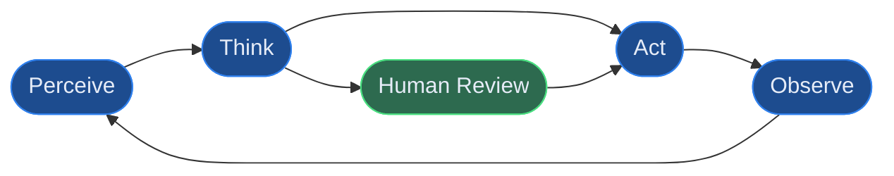
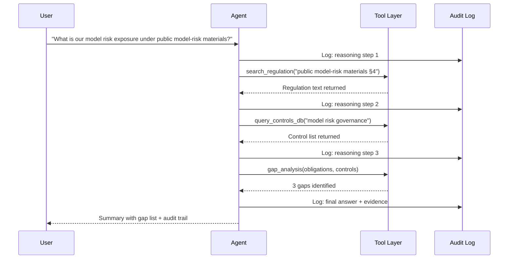
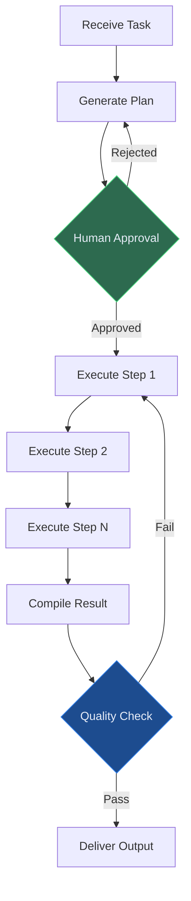
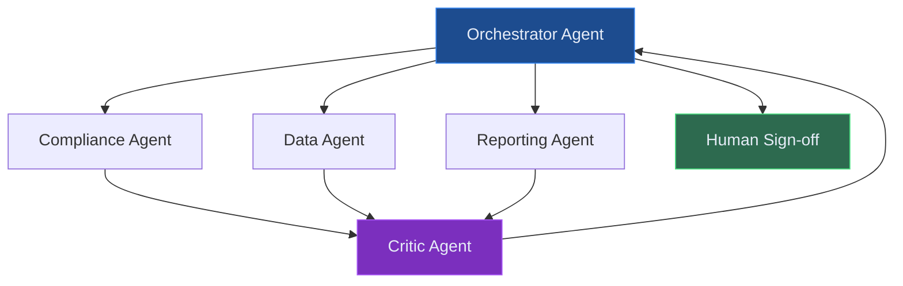
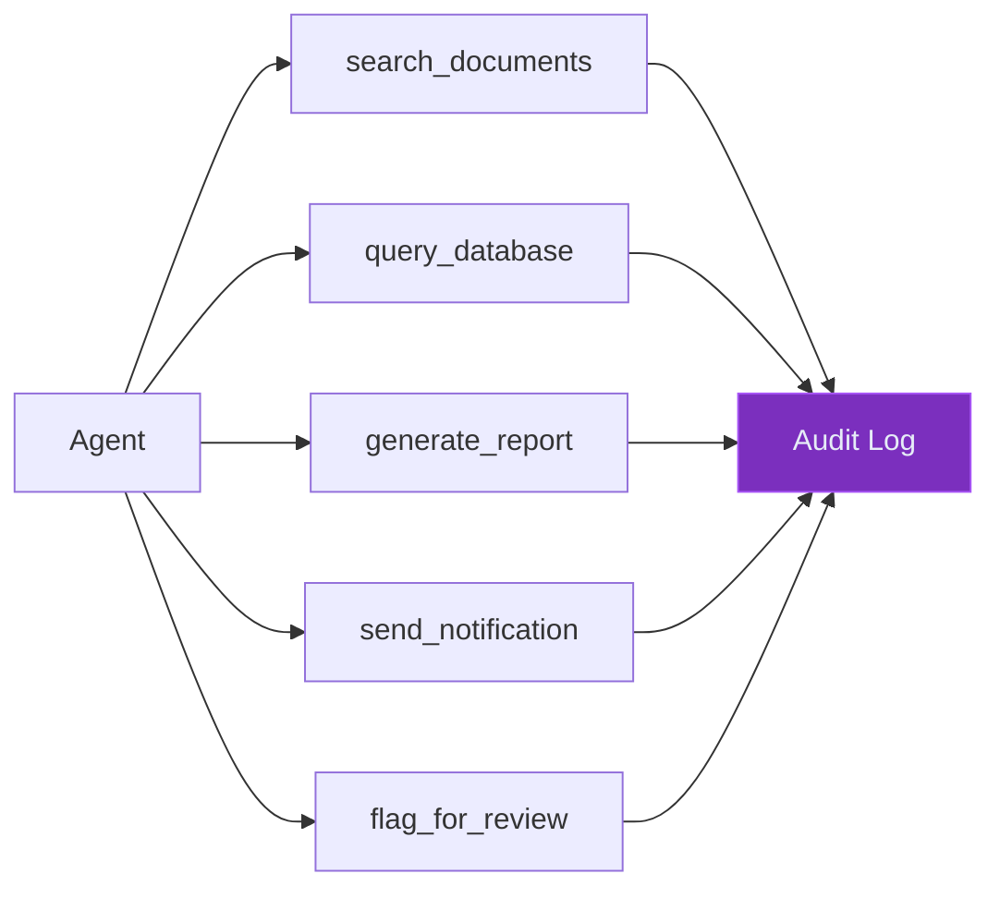
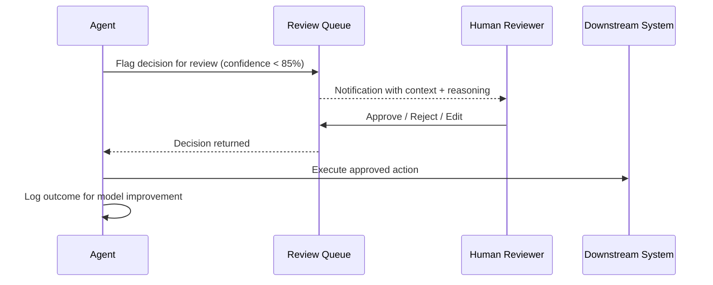
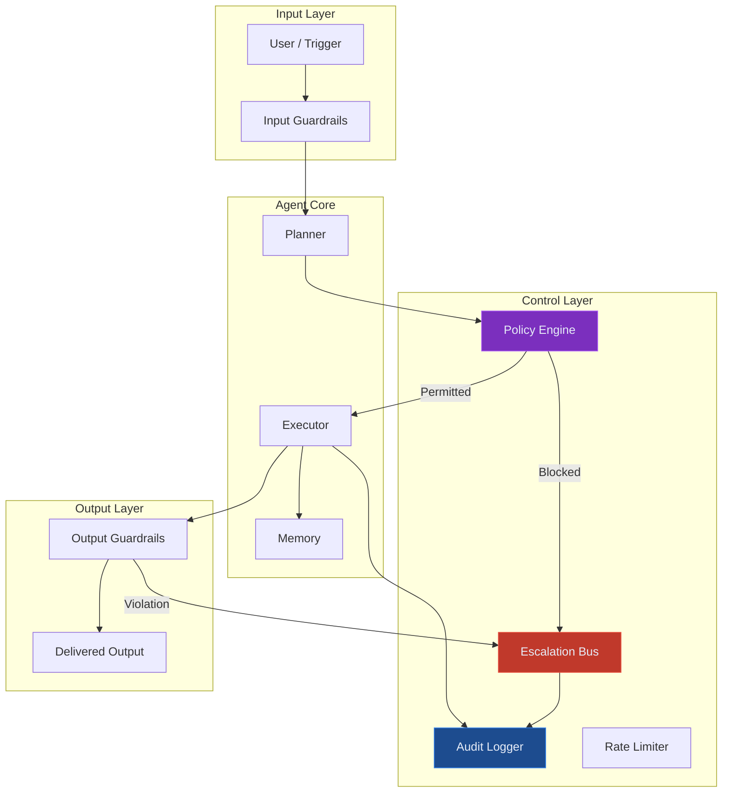

# Agentic AI Design Patterns for Regulated Enterprises

How to architect AI agents that plan, reason, and act across enterprise workflows — with the governance controls that regulated industries demand.

---

## What Makes an Agent Different

Most enterprise AI conceptual conceptual deployments are pipelines — a prompt goes in, a response comes out. Agents are different. An agent **perceives its environment, decides what to do next, executes actions, and adapts based on results** — in a loop, without a human directing each step.

This capability is transformative for regulated enterprises. A compliance agent doesn't just answer questions about PRA rules — it reads the regulation, identifies the relevant obligation, retrieves the firm's control documentation, identifies the gap, drafts the remediation plan, and flags it for human review. That is an entire workflow that previously required a team.

The challenge is that this power comes with risk. In banking, healthcare, and public sector environments, an agent that takes the wrong action — sends the wrong data, creates the wrong document, escalates the wrong case — causes real harm. Governance must be built in from the start.

---

## The Core Agent Loop

Every agent operates on the same fundamental cycle:

**Perceive** — the agent receives input: a user query, a trigger event, a document, a data feed.

**Think** — the LLM reasons about what to do. In advanced agents, this uses chain-of-thought, scratchpad reasoning, or a formal planning step (ReAct, LATS, or tree-of-thought).

**Act** — the agent calls a tool: a search function, an API, a database query, a document generator.

**Observe** — the agent reads the result of its action and decides whether to continue, retry, or escalate.

The **Human Review** node is critical in regulated environments. Not every decision should proceed automatically. The agent should know when to pause and request human approval.

---

## Five Production Agent Patterns

### Pattern 1: ReAct (Reasoning + Acting)

The most widely deployed agent pattern. The LLM interleaves reasoning steps ("I need to find the PRA obligation for model risk...") with action calls ("search_regulation('public model-risk materials model risk')"). The trace of reasoning steps is logged for audit.

**Why it works in regulated environments:** every step is logged, the reasoning is traceable, and tools are discrete functions with defined inputs/outputs that can be audited.

### Pattern 2: Plan-and-Execute

The agent first produces a complete plan (a sequence of steps), then executes each step. This separates planning from execution — useful when the plan needs human approval before any actions are taken.

This is the recommended pattern for **high-stakes actions** — regulatory submissions, patient pathway changes, treasury position adjustments.

### Pattern 3: Multi-Agent Orchestration

Complex enterprise tasks require multiple specialised agents working together. A Planner agent breaks down the task; Specialist agents (Compliance, Data, Reporting) each handle their domain; a Critic agent reviews the output.

In the regulatory intelligence reference blueprint, the Orchestrator receives the audit task, dispatches to the Compliance Agent (obligations), Data Agent (evidence retrieval), and Reporting Agent (pack generation). The Critic validates consistency before the package goes for human sign-off.

### Pattern 4: Tool-Augmented Agent

Tools are the hands of an agent. In enterprise environments, tools must be **bounded, logged, and reversible where possible**. Each tool is a typed function with a defined schema, error handling, and an audit record.

**Principle:** agents in regulated environments should prefer **read tools over write tools**, always log every action, and require elevated permission for irreversible actions (send, submit, delete).

### Pattern 5: Human-in-the-Loop (HITL) Agent

For the highest-risk decisions — a referral triage changing a patient's priority, a governance gap triggering a regulatory notification — the agent pauses, presents its reasoning, and requests explicit human confirmation.

The threshold for HITL intervention is configurable — in healthcare operations, any HIGH urgency referral always passes through a clinician. In public-framework mapping, any gap rated HIGH risk requires a authorised reviewer to approve the remediation plan.

---

## Governance Architecture for Agentic Systems

Governance is not an afterthought — it is a first-class architectural component.

**Policy Engine** — every agent action is checked against a policy ruleset before execution. In a banking agent, this includes: "never write to controlled systems without human approval", "never access data outside this user's permissions", "always attach evidence citations".

**Audit Logger** — every perception, reasoning step, tool call, and output is immutably logged with timestamps and user context. This is non-negotiable in public finance-framework-regulated environments.

**Escalation Bus** — violations, blocked actions, and low-confidence decisions route to a human review queue rather than failing silently.

---

## Common Failure Modes to Design Against

| Failure Mode | Description | Mitigation |
|---|---|---|
| **Hallucinated tool calls** | Agent invents function names or parameters | Strict tool schema validation, constrained output format |
| **Infinite loops** | Agent cannot complete task and retries endlessly | Max iteration limits, loop detection, forced escalation |
| **Context overflow** | Long chains exhaust the context window | Summarisation at checkpoints, memory management |
| **Permission creep** | Agent requests unnecessary tool access | Least-privilege tool design, per-task scoped access |
| **Silent failure** | Tool call fails but agent continues as if it succeeded | Mandatory error handling in every tool wrapper |
| **Goal drift** | Agent optimises for an intermediate goal not the original intent | Goal anchoring in system prompt, Critic agent review |

---

## LorvexAI's Agentic AI Implementation

The LorvexAI reference blueprints use agentic patterns as educational examples. The regulatory intelligence blueprint uses a Plan-and-Execute pattern with a Critic agent validating obligation mappings before any evidence package is generated. The Healthcare Flow Intelligence blueprint uses a ReAct pattern for referral triage, with a mandatory HITL checkpoint for HIGH urgency cases. The Treasury Sentinel blueprint uses a multi-agent pattern with specialist agents for position monitoring, stress testing, and ALCO pack generation.

Every agent conceptual deployment includes our four governance primitives: scoped tool access, immutable audit logging, policy engine enforcement, and configurable HITL thresholds.

---

*For related educational material, explore the [research notes](/research) and [reference blueprints](/blueprints).*
