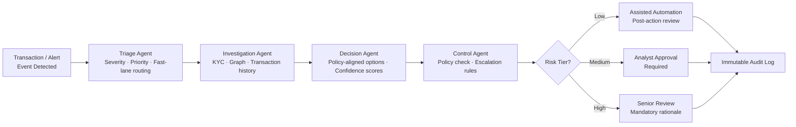
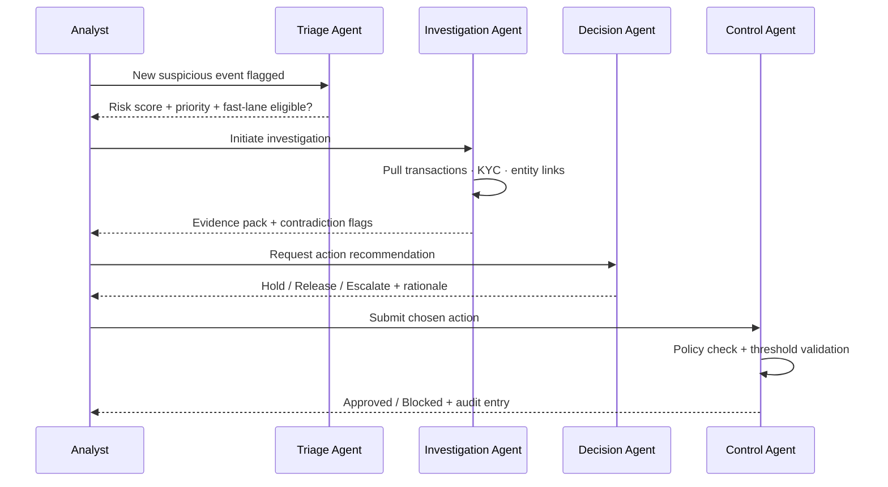
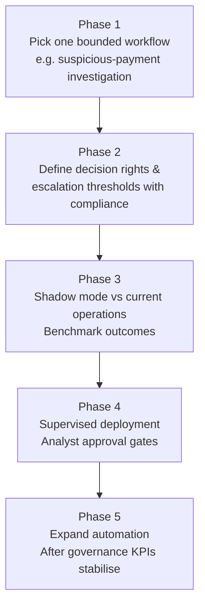

# AI Agents in Banking Operations

AI agents are most impactful in banking when they are deployed as controlled decision systems, not autonomous black boxes. The right operating model combines machine speed for investigation and evidence assembly with explicit human governance for high-impact actions.

---

## Why AI Agents Matter in Banking

Banking operations face a high-friction combination:

- Rising transaction volume and complexity
- Expanding AML, sanctions, and fraud control obligations
- High false-positive burden in investigation queues
- Pressure to reduce decision latency without increasing risk

Agentic systems help by orchestrating multi-step workflows: detect, investigate, propose action, and route decisions through policy and human control gates.

---

## Core Agent Capabilities

### 1. Risk Triage Agent
- Classifies event severity and intent
- Prioritises queue items by risk and business impact
- Routes straightforward cases to fast lanes

### 2. Investigation Agent
- Pulls context from transactions, KYC, graph links, and prior cases
- Builds evidence packs with traceable source references
- Highlights contradictions and missing signals

### 3. Decision Agent
- Generates policy-aligned action options
- Attaches confidence and rationale for each option
- Enforces threshold-based escalation rules

### 4. Control Agent
- Applies regulatory and internal policy checks
- Blocks unsafe actions and forces human review when required
- Logs complete decision traces for audit and remediation

---

## Multi-Agent Orchestration Flow

---

## Architecture Diagram

---

## Banking Example: Financial Crime Investigation Copilot

### Problem
Analyst teams often spend most of their time gathering evidence rather than making decisions. Case triage is slow, false positives are high, and audit evidence quality varies by reviewer.

### Agentic Solution

### Expected Impact
- Lower investigation cycle time
- Reduced false-positive handling overhead
- Better consistency and quality of SAR-supporting evidence

---

## Operating Loop Diagram

---

## Governance Model for Production

### Human-in-the-Loop by Risk Tier

| Risk Tier | Automation Level | Human Role |
| --- | --- | --- |
| Low | Assisted automation | Post-action review |
| Medium | AI recommendation | Analyst approval required |
| High | AI advisory only | Senior reviewer + mandatory rationale |

### Control Objectives
- Every action is traceable to inputs, policy rules, and model outputs
- Escalation criteria are explicit and testable
- Model and policy changes follow release gates and rollback procedures

### Monitoring Stack
- Decision latency by risk tier
- Override rates and override reasons
- Evidence completeness score
- Drift and quality regression signals

---

## Implementation Roadmap

---

## Final Thought

AI agents in banking are valuable when they improve decision integrity and operating speed together. The winning model is calibrated autonomy: fast machine-assisted investigation with strict human and policy control at the right moments.
