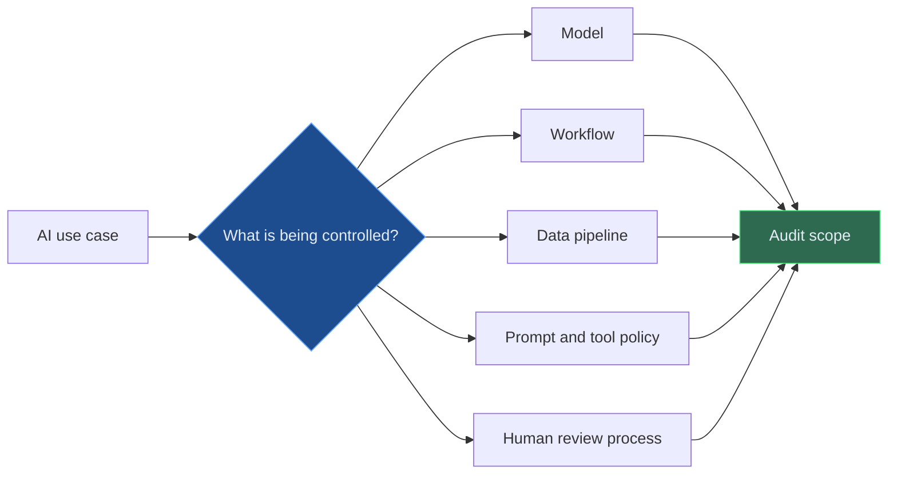
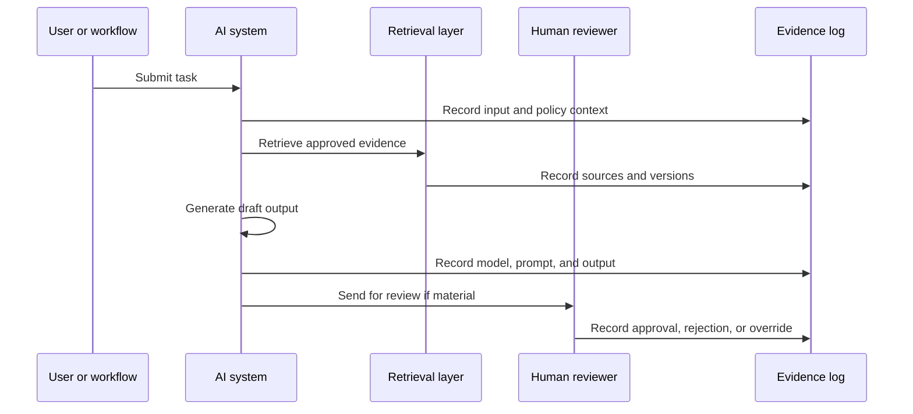

# AI Audit Readiness - Evidence, Controls, Logs, and Human Oversight

AI audit readiness is not about preparing a nice pack when audit arrives. It is about designing the system so the evidence already exists.

That matters because AI risk is often hard to see from the outside. A polished answer can hide weak data, poor retrieval, unsafe prompts, missing approvals, or a model that has drifted away from its original purpose.

Audit readiness asks a simple question: **If someone independent reviewed this AI use case tomorrow, could we show what happened, why it happened, who approved it, and what controls were operating?**

---

## Audit Starts With a Clear Object

Before audit can test an AI system, the organisation needs to define what the "thing" is.

Is it:

- A model?
- A workflow?
- A vendor tool?
- A retrieval-augmented generation system?
- A prompt template?
- A human-in-the-loop decision support process?
- A set of automations around an existing control?

Many problems begin when teams call everything "AI" but cannot describe the control object. Audit cannot test fog.

---

## The Evidence Audit Will Want

A good audit file is not a document dump. It is a chain of evidence.

| Evidence area | Questions audit may ask | Useful artefacts |
| --- | --- | --- |
| Purpose and approval | Why does this AI use case exist? Who approved it? | Use-case charter, approval record |
| Risk assessment | What could go wrong? How was materiality assessed? | Risk assessment, model tiering, DPIA if relevant |
| Data controls | What data is used? Is it permitted? Is lineage known? | Data inventory, lineage, access record |
| Model or tool controls | What model, vendor, or method is used? | Model card, vendor assessment, configuration record |
| Testing | How was performance, safety, bias, or hallucination checked? | Test plan, results, exceptions |
| Human oversight | Where can humans override, reject, or escalate? | Workflow map, approval logs |
| Monitoring | What is watched after deployment or publication? | MI, incident log, drift checks |

The important part is consistency. If every AI use case has a different evidence structure, audit has to reverse-engineer the control framework every time.

---

## Logging Is Not Optional

For traditional systems, logs are often treated as operational plumbing. For AI systems, logs are part of the control environment.

Minimum useful logs include:

- Input timestamp and user or process identity
- Data sources accessed
- Prompt or instruction version
- Model or tool version
- Retrieved documents or evidence references
- Output produced
- Confidence, risk, or policy flags
- Human review decision
- Override, rejection, or escalation reason

Logs should not capture unnecessary personal or confidential data. The goal is enough evidence to reconstruct control behaviour without creating a new data risk.

---

## Audit Readiness Is Different From Audit Perfection

No AI system is perfect. Audit readiness means the organisation can show:

- The intended use was clear
- The risk tier was reasonable
- Controls were designed proportionately
- Exceptions were visible
- Human accountability was not outsourced to the model
- Monitoring continued after launch

That is a much stronger position than saying, "The model is accurate" or "The vendor says it is safe."

---

## Three Lines of Defence for AI

| Line | Role in AI governance | Typical evidence |
| --- | --- | --- |
| First line | Owns the use case, process, data, and outcomes | Use-case pack, operating procedures, issue logs |
| Second line | Sets policy, challenges risk assessment, reviews controls | Policy mapping, challenge notes, approval conditions |
| Third line | Tests whether the framework and controls operate effectively | Audit plan, testing results, findings, remediation |

Audit should not become the design team. But audit can provide early challenge on whether evidence will be testable later.

---

## Final Thought

Audit-ready AI is not slower AI. It is AI that does not collapse under scrutiny.

If the system is important enough to influence a regulated process, customer outcome, financial report, risk assessment, or board discussion, then the evidence should be designed in from day one.

The best time to prepare for audit is before the first impressive demo.

---

*Educational note: This article is for general research and learning. It is not audit, legal, regulatory, compliance, model validation, or professional advice.*
