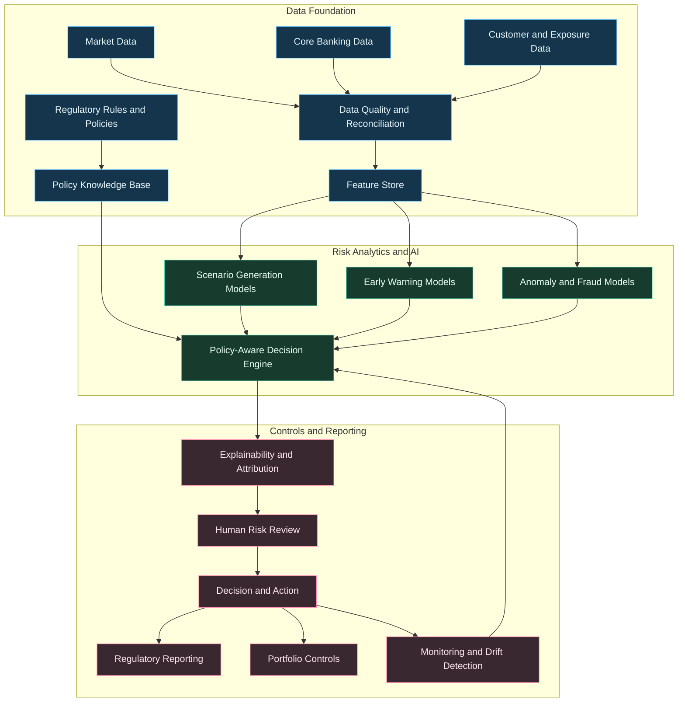
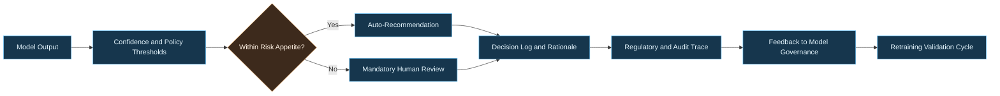

---
title: AI in Financial Risk Management
date: 2026-03-05
excerpt: Applying AI to risk modeling requires governance-first architectures and transparent decision workflows.
tags:
  - Risk
  - Governance
  - Financial Services
---

# AI in Financial Risk Management

Applying AI to risk functions is not only a modeling challenge. It is an operating model challenge where accuracy, governance, explainability, and regulatory readiness must all improve together.

---

## Why Risk AI Requires a Different Standard

In financial services, every recommendation can affect capital allocation, liquidity posture, and compliance outcomes. That means AI systems must be:

- Traceable end to end
- Explainable at decision and feature level
- Controlled by policy and model risk governance
- Continuously monitored for drift and bias

---

## Risk Intelligence Architecture

---

## Priority Use Cases

### 1. Credit Risk Intelligence
- Dynamic probability-of-default monitoring
- Segment-level stress scenario simulation
- Exception routing with explainable drivers

### 2. Market and Liquidity Risk
- Intraday risk signal aggregation
- Scenario expansion under regime shifts
- Liquidity stress propagation analysis

### 3. Operational and Fraud Risk
- Real-time anomaly detection on payment streams
- Behavioral deviation alerts for insider risk
- Case triage with investigation support summaries

---

## Decision Governance Flow

---

## Metrics That Regulators and Boards Care About

### Model Performance
- Precision/recall by risk segment
- Stability across economic regimes
- Out-of-time validation performance

### Governance Performance
- Explainability coverage ratio
- Manual override rate by decision class
- Time-to-resolution for high-risk alerts

### Business Impact
- Loss avoidance and exposure reduction
- Capital efficiency improvement
- Compliance incident reduction

---

## Common Failure Modes and Controls

### Failure: Hidden Data Drift
- Risk: model quality degrades silently
- Control: drift alarms + challenger models + retrain triggers

### Failure: Spurious Correlations
- Risk: brittle decisions under market stress
- Control: stress backtesting and causal feature review

### Failure: Weak Auditability
- Risk: regulatory challenge and remediation cost
- Control: immutable decision logs, lineage, and evidence bundles

---

## Practical Rollout Strategy

1. Start with advisory mode before automated decisions
2. Build explainability and logging before scale
3. Integrate model outputs into existing risk committees
4. Use dual-control approvals for high-impact actions
5. Move to selective automation only after sustained control performance

---

## Final Thought

AI in risk management is successful when it strengthens decision integrity, not just prediction speed. The goal is resilient, auditable, policy-aligned intelligence at enterprise scale.
