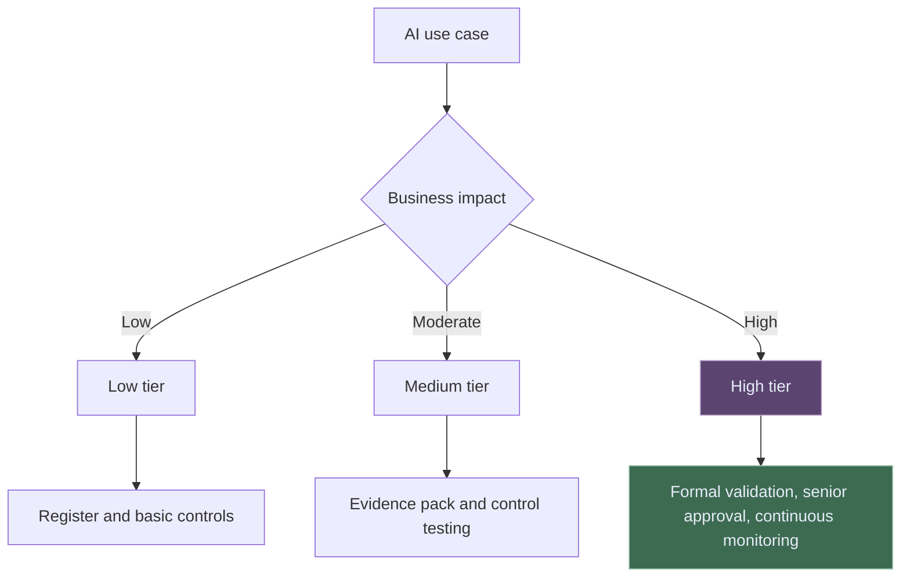

# AI Model Inventory and Tiering for Banks

You cannot govern AI you cannot find.

That sounds obvious, but it is where many AI governance programmes struggle. AI arrives through innovation teams, business experiments, productivity tools, vendor platforms, analytics functions, data science teams, and technology modernisation programmes.

By the time governance teams ask for an inventory, the organisation may already have dozens of use cases in motion.

The purpose of an AI inventory is not to create paperwork. It is to create visibility.

---

## What Belongs in the Inventory?

The inventory should include more than traditional predictive models.

| Item type | Include? | Why |
| --- | --- | --- |
| Machine learning model | Yes | Traditional model risk applies |
| LLM workflow | Yes | Outputs can influence judgement or process execution |
| RAG system | Yes | Retrieval quality and source control matter |
| Prompt template library | Sometimes | Include if used in controlled or repeated workflows |
| Agentic workflow | Yes | Tool use and autonomy create additional risks |
| Vendor AI feature | Yes | Outsourced does not mean risk-free |
| Spreadsheet macro with no AI | Usually no | Govern through other technology controls |

The test is simple: if AI meaningfully shapes an output, recommendation, decision support process, customer interaction, financial analysis, risk view, or control activity, it should probably be visible.

---

## The Minimum Useful Inventory

An AI inventory does not need 80 fields on day one. It needs enough information to support risk decisions.

| Field | Why it matters |
| --- | --- |
| Use-case name | Creates a stable reference |
| Business owner | Assigns accountability |
| Process supported | Links AI to operational context |
| Model or tool type | Separates ML, LLM, RAG, vendor, agentic workflow |
| Data used | Identifies confidentiality, quality, and permission issues |
| Output type | Shows whether it drafts, scores, recommends, predicts, or executes |
| Human oversight | Clarifies decision boundaries |
| Materiality tier | Drives governance depth |
| Approval status | Shows whether it is experimental, approved, restricted, or retired |
| Monitoring owner | Prevents "set and forget" risk |

---

## Tiering: The Heart of Proportional Governance

Tiering is how banks avoid two bad outcomes: over-governing harmless tools and under-governing material systems.

Tiering should consider:

- Financial impact
- Customer or conduct impact
- Regulatory reporting impact
- Capital, liquidity, credit, market, or operational risk impact
- Degree of automation
- Complexity and explainability
- Data sensitivity
- Third-party dependency
- Reversibility of errors

---

## Example Tiering Matrix

| Impact / complexity | Low complexity | Medium complexity | High complexity |
| --- | --- | --- | --- |
| Low impact | Tier 1 | Tier 1 | Tier 2 |
| Medium impact | Tier 2 | Tier 2 | Tier 3 |
| High impact | Tier 3 | Tier 3 | Tier 3 |

Tier 1 might allow lightweight registration and basic rules. Tier 2 might require a documented evidence pack, testing, and periodic review. Tier 3 should trigger formal model risk governance, validation, senior approval, and tighter monitoring.

The matrix should be adapted to the institution. The important thing is that tiering is consistent and challengeable.

---

## Common Inventory Failure Modes

| Failure mode | Why it hurts |
| --- | --- |
| Only data science models are captured | Vendor AI and workflow AI stay invisible |
| No owner is recorded | Issues cannot be remediated cleanly |
| Tiering is self-declared with no challenge | Teams may understate materiality |
| Prompt and retrieval changes are not tracked | Control evidence becomes stale |
| Retired use cases stay active in practice | Shadow AI accumulates |

Good inventory governance includes periodic attestations from business and technology owners.

---

## Final Thought

An AI inventory is not glamorous. But it is one of the most important building blocks of AI governance.

Once the inventory is reliable, the organisation can have mature conversations about risk appetite, model validation, audit planning, board reporting, vendor exposure, and investment priorities.

Without it, AI governance is mostly guesswork.

---

*Educational note: This article is for general research and learning. It is not legal, regulatory, model validation, audit, compliance, or professional advice.*
