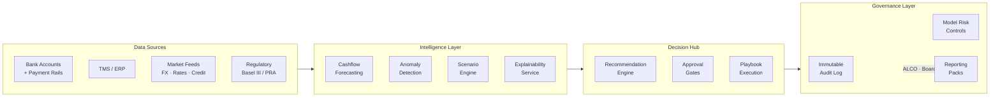
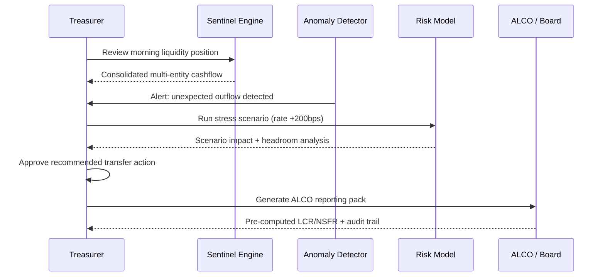
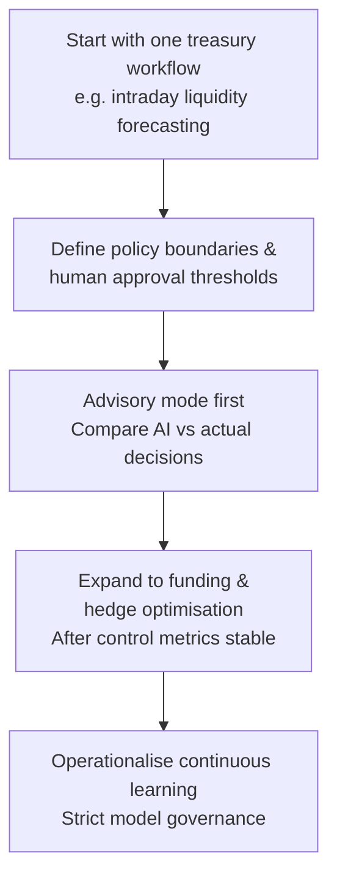

# AI-Native Treasury Control Tower: Real-Time Liquidity, Risk, and Decisioning

Treasury teams are under pressure to make faster decisions with higher confidence across liquidity, funding, and risk. AI is most valuable when it is embedded into the treasury operating model, not added as another dashboard.

---

## Where AI Creates the Most Value in Treasury

### 1. Intraday Liquidity Forecasting
- Predict cash positions hour by hour across entities and currencies
- Detect emerging shortfalls before cut-off windows
- Recommend transfer, borrowing, or investment actions

### 2. Dynamic Funding and Hedging Decisions
- Score alternative funding routes by cost, risk, and policy fit
- Simulate hedge choices under changing market conditions
- Surface recommended action bundles with confidence scores

### 3. Early Warning for Treasury Risk
- Detect anomalies in payment flows and concentration risk
- Flag limit breaches before formal threshold events
- Trigger playbooks for counterparty and market stress

### 4. Policy-Aware Decision Support
- Apply internal policy and regulatory constraints at recommendation time
- Route high-impact actions to approval workflows
- Preserve full decision trace for audit and board review

---

## Reference Architecture

---

## Platform Data Flow

---

## Functional Blueprint

### Data Fabric
- Connect bank accounts, payment rails, ERP/TMS, and market feeds
- Blend batch and stream ingestion for near-real-time visibility
- Enforce data quality checks and reconciliation as first-class controls

### Intelligence Layer
- Forecasting models for liquidity horizons
- Scenario engines for stress and regime-change analysis
- Explainability services for every recommendation

### Decision Hub
- Recommendation engine for funding, transfer, and hedge options
- Approval gates by risk tier and delegated authority
- Playbook execution with rollback and exception logic

### Governance Layer
- Immutable logs for recommendations, approvals, and overrides
- Model risk controls, versioning, and change governance
- Reporting packs for ALCO, risk committee, and regulators

---

## Real-Time Decision Loop

---

## Morning Liquidity Workflow

---

## Example Use Cases by Treasury Function

### Cash and Liquidity Management
- Predict same-day shortfalls and optimise internal sweeping
- Recommend actions to minimise idle cash and overdraft costs

### Funding Desk
- Prioritise funding options by spread, tenor, and concentration limits
- Rebalance short-term and term funding under stress scenarios

### Risk and Control
- Detect unusual exposure build-up by currency or counterparty
- Auto-generate exception summaries for control teams

### Executive Reporting
- Produce scenario-linked narratives for CFO and ALCO
- Explain which decisions reduced risk and at what cost

---

## KPI Stack for Business Impact

| Category | KPI | Target |
| --- | --- | --- |
| Financial | Funding cost reduction | Measurable vs baseline |
| Financial | Liquidity buffer optimisation | Improved utilisation |
| Risk | Earlier detection of limit stress | +24–48h lead time |
| Risk | Fewer unplanned liquidity events | Reduction vs prior year |
| Operating | Decision cycle time | Significant reduction |
| Operating | Committee-ready evidence | Same-day generation |

---

## Implementation Strategy

---

## Final Thought

An AI-native treasury control tower is not about replacing treasury judgment. It is about upgrading judgment with real-time intelligence, disciplined governance, and measurable financial impact.
