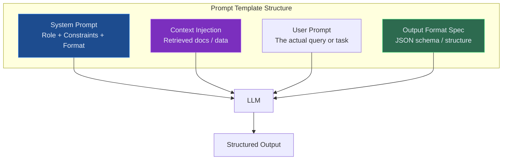
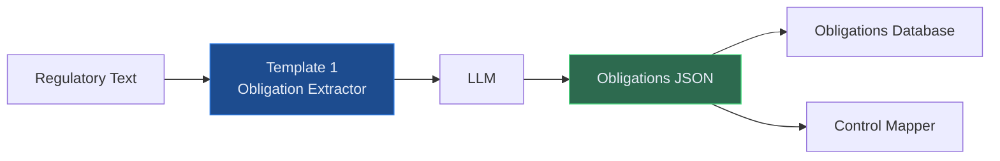
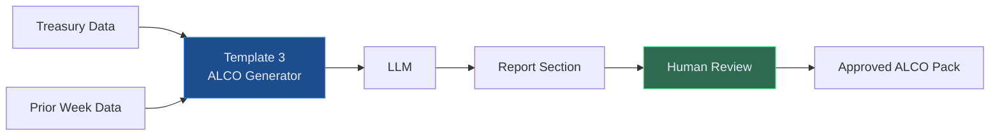
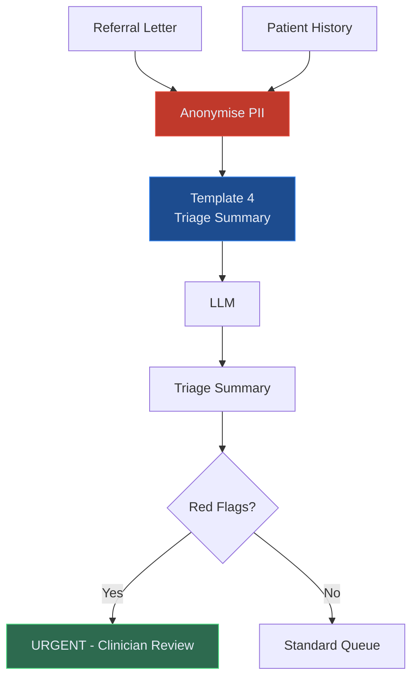
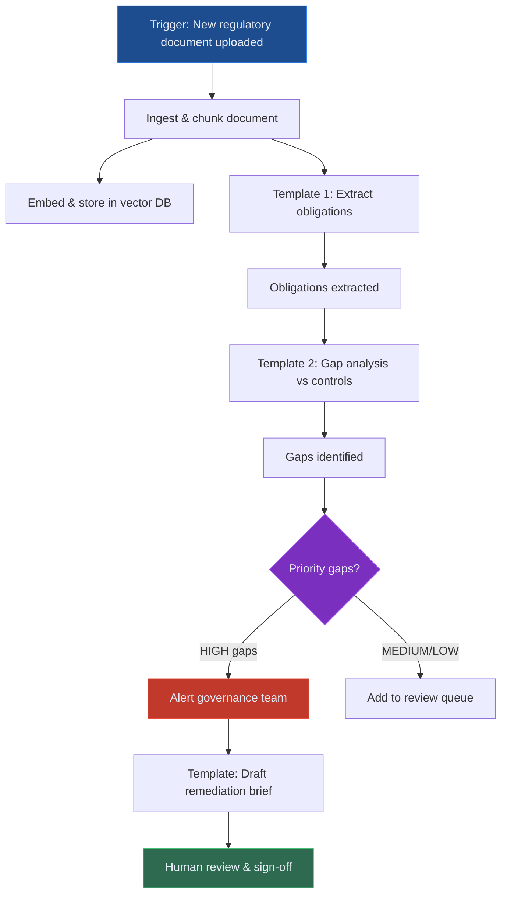
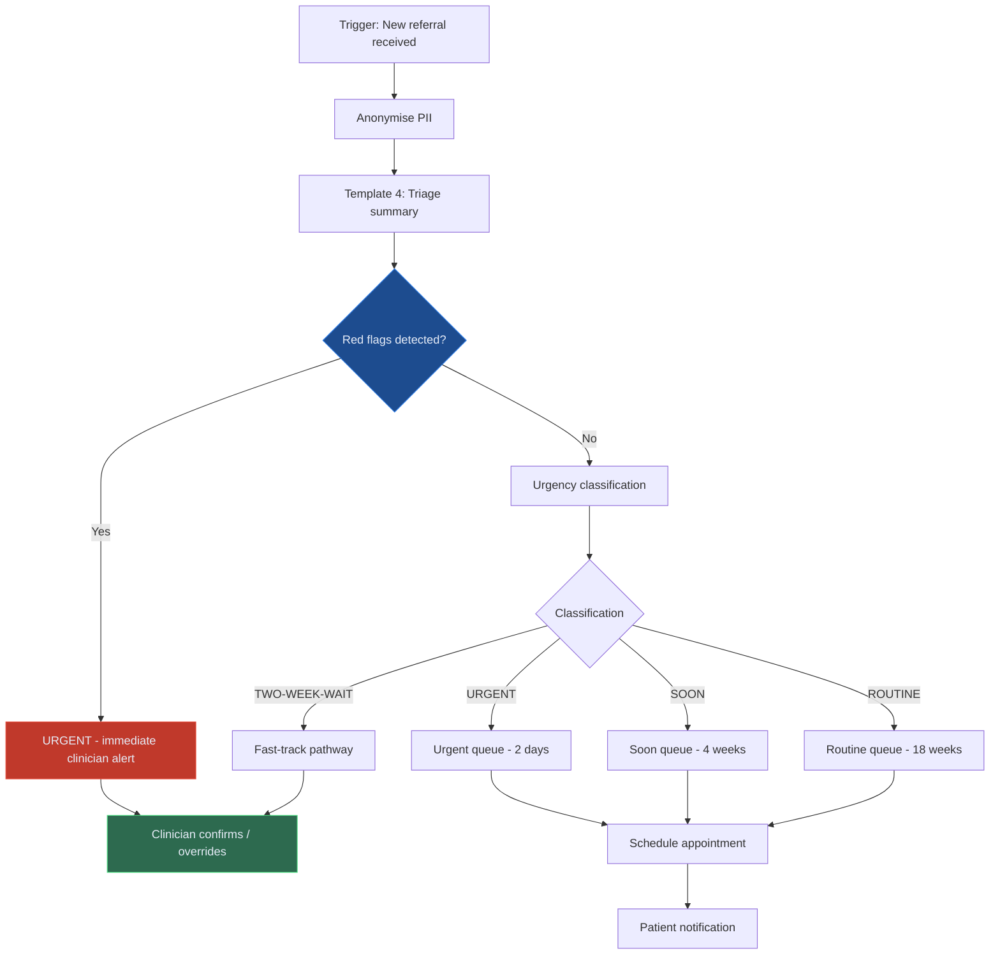
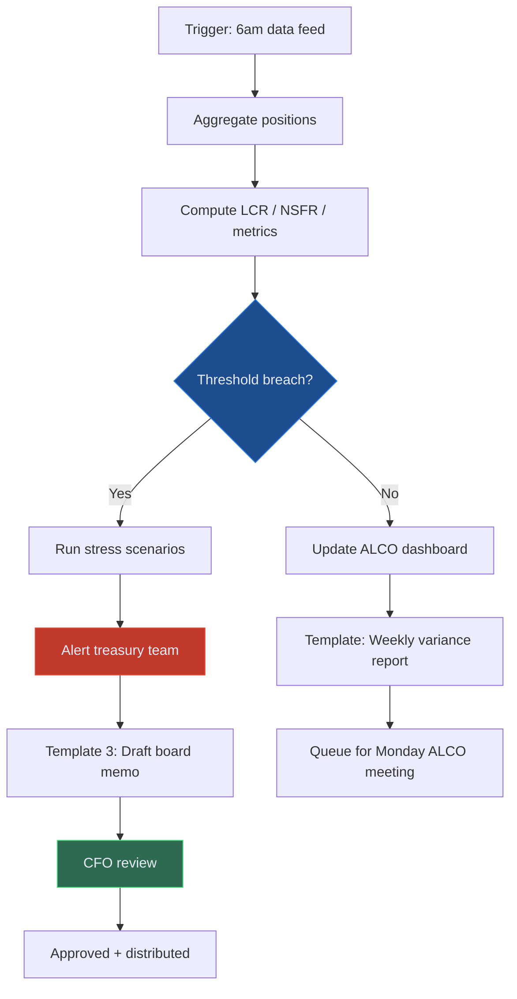
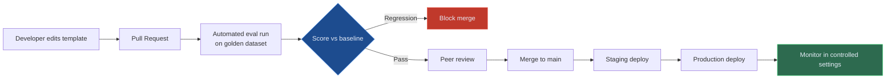

# AI Prompt and Workflow Templates for Finance and Healthcare

Reference prompt patterns and reusable workflow templates for regulated AI conceptual conceptual deployments — covering governance analysis, clinical summarisation, risk reporting, and agentic task orchestration.

---

## Why Templates Matter in Enterprise AI

Enterprise AI fails not because the models are incapable but because teams reinvent the same patterns repeatedly — each team writing their own version of a governance analysis prompt, each slightly different, none consistently reliable.

Templates solve this by encoding **proven patterns** into reusable building blocks. A well-designed prompt template for regulatory obligation extraction, tested on 500 examples and refined over three months, will consistently outperform a prompt written from scratch in an afternoon.

This article covers core templates used across the regulatory intelligence, healthcare flow, and Treasury Sentinel reference blueprints, structured as educational patterns for conceptual deployments.

---

## The Anatomy of a Production Prompt Template

Every reference prompt template has four components:



**System Prompt** — sets the role, constraints, and non-negotiable rules. This is where compliance guardrails live.

**Context Injection** — the retrieved documents, data, or previous conversation injected at runtime. This is where RAG plugs in.

**User Prompt** — the task or query, dynamically populated from user input or a workflow trigger.

**Output Format Spec** — explicit instructions for response structure, including JSON schemas for machine-parseable outputs.

---

## Finance and Banking Templates

### Template 1: Regulatory Obligation Extraction

**Use case:** Extract structured obligations from a regulatory document section.

```
SYSTEM:
You are a regulatory obligations analyst specialising in public finance-framework, and Basel frameworks.
Your task is to extract obligations from the provided regulatory text.

Rules:
- Extract ONLY obligations explicitly stated in the text
- Do NOT infer obligations not stated
- Classify each as: SHALL (mandatory), SHOULD (recommended), MAY (permitted)
- Every obligation must reference the exact section it came from
- Output as JSON array only — no narrative

OUTPUT FORMAT:
{
  "obligations": [
    {
      "id": "OBL-001",
      "reference": "public model-risk materials §4.2",
      "text": "Exact obligation text from source",
      "type": "SHALL | SHOULD | MAY",
      "applies_to": ["model risk", "validation", ...],
      "deadline": "date if specified or null"
    }
  ]
}

CONTEXT:
{retrieved_regulatory_text}

USER:
Extract all obligations from the above regulatory text.
```



---

### Template 2: Control Gap Analysis

**Use case:** Compare a set of regulatory obligations against existing controls and identify gaps.

```
SYSTEM:
You are a governance gap analyst. You will receive:
1. A list of regulatory obligations (from regulation source)
2. A list of existing controls (from internal control inventory)

Your task is to identify gaps where obligations are not fully met by existing controls.

Rules:
- Match obligations to controls by topic and scope
- A gap exists when: no control exists, or the control is partial
- Rate each gap: HIGH (no control), MEDIUM (partial control), LOW (minor deficiency)
- Do NOT recommend specific remediation — only identify and classify gaps
- Output as structured JSON

CONTEXT:
OBLIGATIONS:
{obligations_json}

EXISTING CONTROLS:
{controls_json}

USER:
Identify all gaps between the provided obligations and controls.
```

---

### Template 3: ALCO Report Section Generator

**Use case:** Generate a structured ALCO board report section from treasury data.

```
SYSTEM:
You are a senior treasury analyst writing for an ALCO board report.
Write in formal UK financial English. Be precise with numbers. Use tables where data is comparative.

Rules:
- Do not speculate about future rates or market movements
- Every numeric claim must reference the provided data
- Flag any metric that has moved more than 5% week-on-week
- Keep executive summary to 3 sentences maximum
- Use PRA/Basel terminology throughout

CONTEXT:
TREASURY DATA:
{treasury_metrics_json}

PRIOR WEEK DATA:
{prior_week_metrics_json}

USER:
Generate the Liquidity Risk section of this week's ALCO report.
Include: Executive Summary, LCR/NSFR metrics table, week-on-week commentary, and alerts.
```



---

## Healthcare Operations Templates

### Template 4: Referral Triage Summary

**Use case:** Generate a structured triage summary from an inbound GP referral letter.

```
SYSTEM:
You are a clinical triage assistant supporting healthcare specialist teams.
You summarise GP referral letters to assist clinicians in prioritisation decisions.

Rules:
- You do NOT make clinical decisions — you summarise and flag key information
- Always flag: RED FLAGS (potential cancer/emergency indicators), COMORBIDITIES, MEDICATIONS
- Use standard NHS clinical terminology
- Output must be scannable in under 30 seconds
- Include a suggested urgency classification (ROUTINE / SOON / URGENT / TWO-WEEK-WAIT)
  with your reasoning — the clinician makes the final decision

CONTEXT:
REFERRAL LETTER:
{referral_text}

PATIENT HISTORY (anonymised):
{patient_history_summary}

USER:
Generate a structured triage summary for this referral.
```



---

### Template 5: Discharge Summary Generator

**Use case:** Draft a patient discharge summary from structured clinical notes.

```
SYSTEM:
You are a clinical documentation assistant supporting healthcare ward teams.
You draft discharge summaries from structured clinical notes for clinician review and sign-off.

Rules:
- This is a DRAFT for clinician review — make this explicit in output
- Use standard ICD-10 terminology for diagnoses
- Include ALL medications with doses and durations
- Flag any outstanding investigations or follow-up actions
- Do NOT include information not present in the source notes
- Output in structured discharge summary format per local healthcare guidance

CONTEXT:
CLINICAL NOTES:
{clinical_notes}

INVESTIGATION RESULTS:
{investigation_results}

USER:
Draft a discharge summary for this patient episode.
```

---

### Template 6: Waiting List Intelligence Brief

**Use case:** Generate a weekly waiting list intelligence brief for a specialty team.

```
SYSTEM:
You are a healthcare operations analyst supporting healthcare specialty teams.
Generate a concise weekly intelligence brief from waiting list data.

Rules:
- Highlight: patients approaching 18-week RTT threshold, unexpected volume changes, capacity constraints
- Flag any patient waiting > 40 weeks by name (ID only, no clinical details)
- Compare to same week last month and same week last year
- Keep narrative to 200 words maximum — use tables for data
- Recommend 1-3 specific operational actions

CONTEXT:
CURRENT WAITING LIST DATA:
{waiting_list_data}

HISTORICAL BENCHMARKS:
{benchmark_data}

USER:
Generate this week's waiting list intelligence brief for {specialty_name}.
```

---

## Workflow Templates

### Workflow Template A: Document Review and Obligation Extraction Pipeline



### Workflow Template B: Healthcare Referral Processing Pipeline



### Workflow Template C: Daily Treasury Monitoring Pipeline



---

## Template Governance: Version Control and Testing

Templates are code. They must be version-controlled, tested, and deployed with the same rigour as application code.



**Template versioning best practices:**
- Every template has a version number (`obligation-extractor-v2.3`)
- Every LLM call logs the template version used — essential for reproducing outputs in an audit
- Breaking changes (those that alter output structure) increment the major version
- All reference templates are stored in version control, not in a database or config file
- Template changes require an evaluation run against the golden dataset before conceptual deployment

---

## Building Your Own Template Library

Start with the highest-frequency, highest-value tasks in your team. For a governance team:

1. **Week 1**: Identify the 3 tasks that consume the most time and have clear, structured outputs (obligation extraction, gap analysis, report drafting)
2. **Week 2**: Write the first version of each template, test manually on 20 examples
3. **Week 3**: Build a 100-example golden dataset, measure baseline performance
4. **Week 4**: Iterate on the worst-performing template, retest, deploy

After one month you will have three production-aware templates that consistently outperform ad-hoc prompting and save hours of manual work per week.

---

*The templates in this article are adapted from LorvexAI's reference library. Want access to the full template library for your domain? [Get in touch](/contact).*
