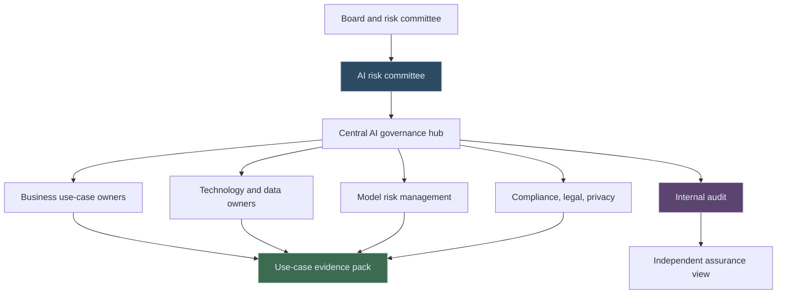

# AI Strategy and Governance for Regulated Financial Institutions

AI strategy in a regulated financial institution is not a technology roadmap with nicer slides. It is a control problem, an accountability problem, and only then a delivery problem.

The difficult question is not "Can we use AI?" The difficult question is: **Can we explain where AI is being used, why it is appropriate, who owns the risk, what evidence supports it, and when a human must remain accountable?**

That is the level at which boards, risk committees, model risk teams, audit teams, and regulators will eventually look at AI adoption.

---

## The Strategy Should Start With Risk Appetite

Many AI programmes start with use cases. That is natural, but it is incomplete. In regulated financial services, AI strategy should begin with risk appetite.

Before choosing tools, firms need to decide:

- Which AI use cases are allowed?
- Which use cases require model risk review?
- Which use cases require legal, compliance, conduct, privacy, or operational risk review?
- Which outputs can support decisions, and which outputs must never make decisions?
- Which data is permitted, restricted, or prohibited?
- Which roles are accountable for sign-off?

This is not bureaucracy for its own sake. It is how an institution avoids uncontrolled experimentation becoming shadow infrastructure.

---

## A Good AI Governance Model Has Four Lines of Clarity

The phrase "AI governance" can become vague very quickly. A useful governance model makes four things clear.

| Governance question | What good looks like | Evidence to keep |
| --- | --- | --- |
| Purpose | The use case has a clear business or risk objective | Use-case charter, expected benefits, risk assessment |
| Ownership | Business, technology, model risk, compliance, and operations know their roles | RACI, approval record, policy mapping |
| Control | Inputs, outputs, prompts, data, tools, and human gates are controlled | Control library, test results, exception logs |
| Monitoring | The system is watched after launch or publication | MI dashboard, drift checks, incident log, review calendar |

The point is not to make every AI experiment feel like a capital model. The point is to scale governance proportionately.

Low-risk internal summarisation does not need the same control depth as a model used in credit, liquidity, fraud, financial promotion, regulatory reporting, or customer interaction. But both need traceability.

---

## What Regulators Are Signalling

The public direction is clear: supervisors are not treating AI as magic, and they are not treating it as exempt from existing expectations.

In the UK, the PRA's model risk management expectations in [SS1/23](https://www.bankofengland.co.uk/prudential-regulation/publication/2023/may/model-risk-management-principles-for-banks-ss) are highly relevant to AI and machine learning models. The Bank of England and FCA have also discussed AI adoption in UK financial services through surveys and feedback statements.

In Europe, ECB Banking Supervision has highlighted AI and generative AI as areas of continuing supervisory attention, especially around governance, strategy, and risk management.

In the United States, banking agencies have updated model risk management guidance, while the SEC has been active on AI claims, predictive analytics, conflicts, and governance discussions.

That does not mean every AI use case is a regulated model. It means firms need a defensible method for deciding what it is.

---

## The Operating Model

A practical operating model should avoid two extremes:

- A central committee that slows everything down
- A free-for-all where every team builds its own AI controls

The better model is a federated one.

The central hub owns standards, templates, guardrails, and reporting. Business teams own use-case purpose and outcomes. Risk and control functions challenge assumptions. Audit checks whether the framework works in practice.

---

## The Most Useful Artefact: The AI Use-Case Evidence Pack

If I could recommend one practical artefact, it would be a simple evidence pack for every material AI use case.

It should answer:

| Section | Why it matters |
| --- | --- |
| Use-case purpose | Prevents unclear or opportunistic adoption |
| Data sources | Shows whether data is permitted and appropriate |
| Model or tool type | Distinguishes rules, ML, LLM, RAG, agentic workflow, vendor tool |
| Materiality tier | Drives proportional governance |
| Human oversight | Clarifies what the AI can and cannot decide |
| Testing | Captures accuracy, robustness, bias, hallucination, security, or conduct checks |
| Monitoring | Shows how issues will be detected after use |
| Exit plan | Explains how the system can be paused, replaced, or retired |

This pack becomes the bridge between strategy and assurance.

---

## Final Thought

The strongest AI strategies in financial institutions will not be the flashiest. They will be the ones that make adoption repeatable, explainable, and governable.

AI strategy should help the institution move faster, but only because the rules of the road are clearer.

That is the real prize: not isolated AI experiments, but a controlled operating model that lets useful AI work survive scrutiny.

---

*Educational note: This article is for general research and learning. It is not legal, regulatory, financial, compliance, model validation, audit, or professional advice.*
