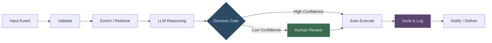
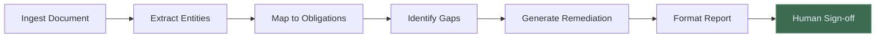
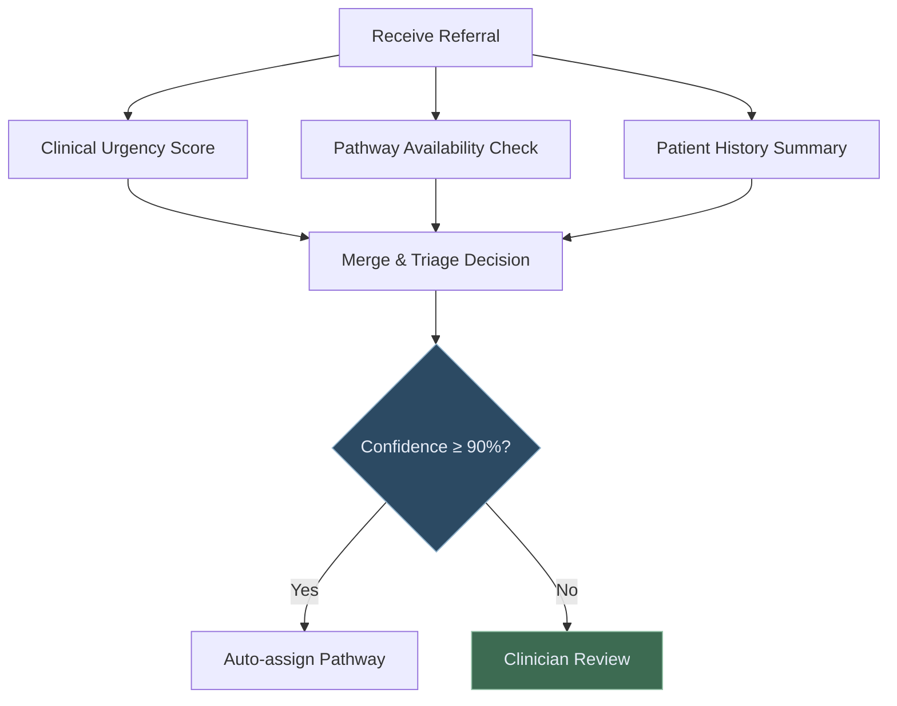
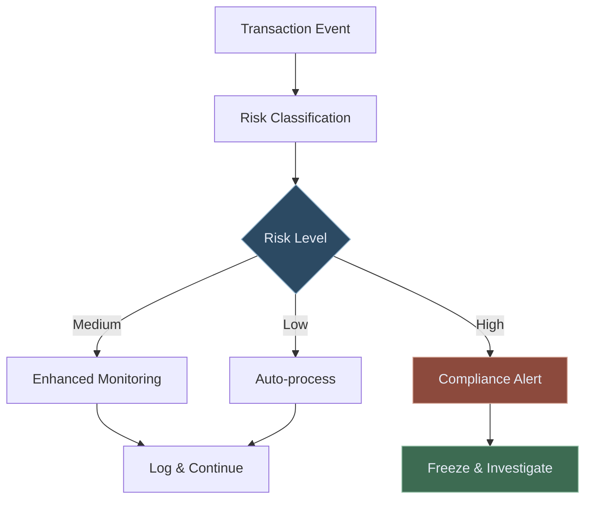
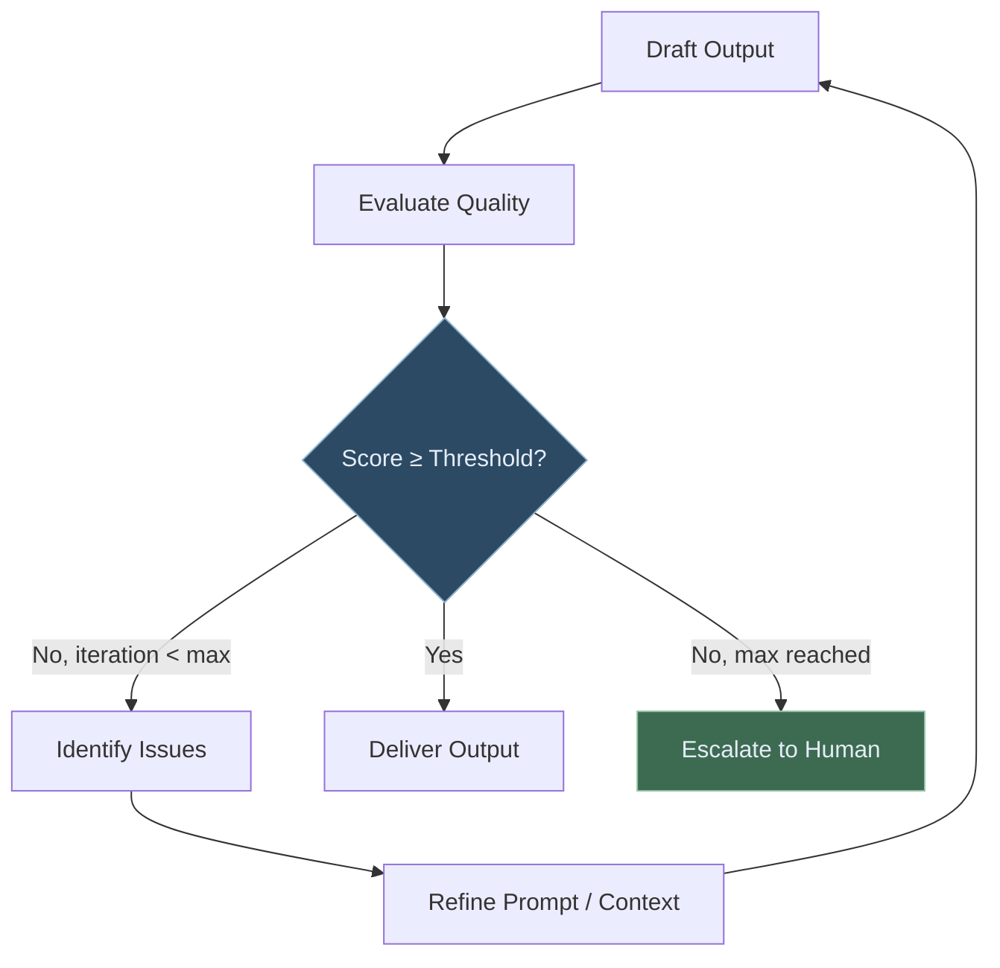
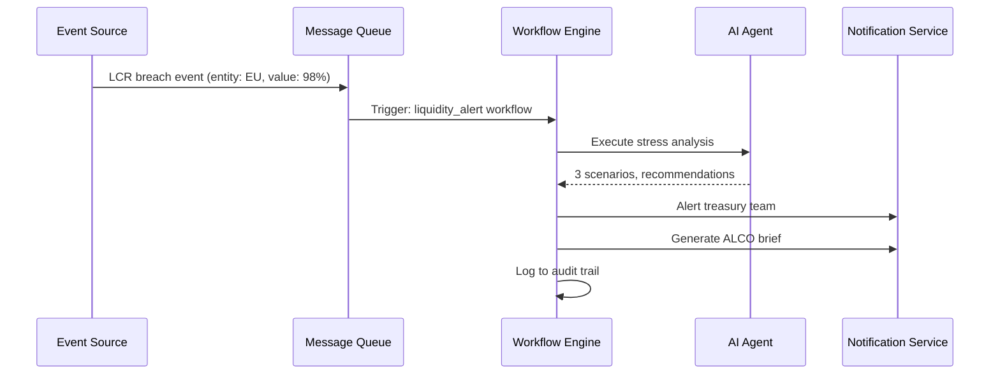
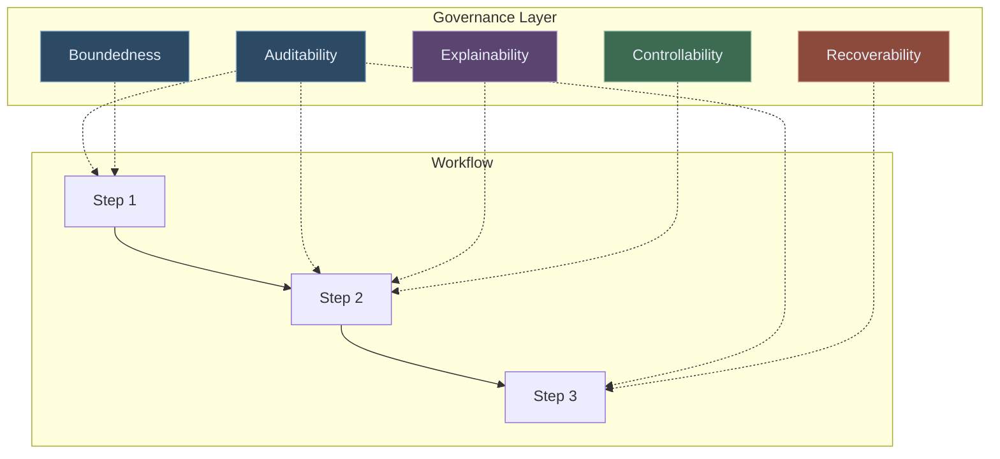
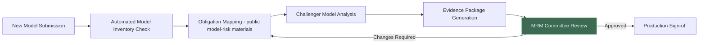
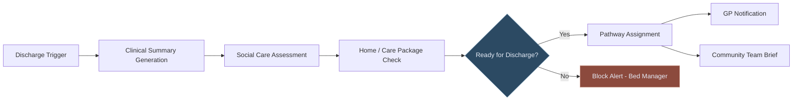
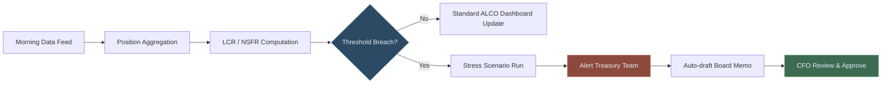

# AI Workflows for Regulated Enterprises

How to design, orchestrate, and govern multi-step AI workflows across banking, healthcare, and healthcare operations — without breaking compliance.

---

## Why Workflows Matter More Than Models

The AI conversation in enterprise has been dominated by model selection — GPT-4 vs Claude vs Llama. But model choice is rarely the bottleneck. The real constraint is **workflow design**: how tasks are decomposed, how steps are sequenced, how data flows between components, and how humans stay in control.

A well-designed AI workflow running on a mid-tier model will consistently outperform a poorly-designed workflow on a frontier model. And in regulated environments — where every output must be explainable, auditable, and defensible — workflow architecture is not optional. It is the product.

---

## What is an AI Workflow?

An AI workflow is a **structured sequence of steps that combines LLM calls, tool executions, data retrievals, conditional logic, and human checkpoints** to accomplish a complex task.

Unlike a simple prompt-response exchange, a workflow:
- Has defined inputs and outputs at each step
- Handles errors and retries explicitly
- Routes decisions based on confidence, risk level, or data conditions
- Logs every step for audit
- Supports human review at configurable checkpoints

---

## Core Workflow Patterns

### Pattern 1: Linear Sequential Workflow

The simplest pattern — steps execute in order, each passing output to the next. Used for document processing, report generation, and governance checks where the sequence is deterministic.

**Example pattern:** A regulatory intelligence reference blueprint can use this pattern to process new PRA circulars — ingesting the document, extracting obligations, mapping to existing controls, identifying gaps, and generating a remediation brief for a governance review.

### Pattern 2: Parallel Fan-out Workflow

Multiple steps execute simultaneously, then results are merged. Dramatically reduces latency for tasks that have independent sub-components.

**Example in practice:** Healthcare Flow Intelligence blueprint runs urgency scoring, pathway matching, and patient history summarisation in parallel, then merges results for the final triage decision — reducing average processing time from minutes to under 5 seconds.

### Pattern 3: Conditional Branching Workflow

Workflow routes differ based on data conditions, confidence scores, or risk classifications. Enables intelligent escalation without hard-coding every scenario.

### Pattern 4: Loop / Iterative Workflow

The workflow repeats until a quality criterion is met. Used for document drafting, evidence compilation, and scenario analysis where a single pass is rarely sufficient.

### Pattern 5: Event-Driven Workflow

Workflows triggered by external events — a new filing, a market movement, an inbound referral, a threshold breach. The trigger is usually a message queue or webhook; the workflow executes asynchronously.

---

## Workflow Governance: The Five Pillars

Regulated enterprises need more than functional workflows. They need workflows that are **auditable, explainable, controllable, recoverable, and bounded**.

**Auditability** — every step writes an immutable log entry: timestamp, inputs, outputs, model version, latency, and confidence score. This is the audit trail for regulators.

**Explainability** — the reasoning at each LLM step is captured as a scratchpad. For public consumer-outcomes materials compliance, the "why" behind every AI-influenced decision must be retrievable.

**Controllability** — authorised users can pause, redirect, or override any workflow at any step. A authorised reviewer can halt a workflow mid-execution and reroute it.

**Recoverability** — if a step fails, the workflow can resume from the last successful checkpoint, not from the beginning. This prevents data loss and duplicate actions.

**Boundedness** — every workflow has defined data access scopes, maximum iteration counts, timeout limits, and permitted tool sets. Unbounded workflows are a governance risk.

---

## Workflow Design for Specific Regulated Use Cases

### Banking — Model Risk Validation Workflow

### NHS — Discharge Pathway Workflow

### Treasury — Daily Liquidity Monitoring Workflow

---

## Choosing a Workflow Orchestration Approach

| Approach | Best For | Trade-offs |
|---|---|---|
| **Hardcoded DAG** | Stable, well-understood processes | Fast, reliable; brittle to change |
| **LLM-planned workflow** | Dynamic, variable tasks | Flexible; less predictable |
| **Hybrid (planned + guarded)** | Most regulated enterprise use cases | Best of both; requires more engineering |
| **Event-driven** | Real-time monitoring and alerting | Low latency; complex state management |

LorvexAI recommends the **hybrid approach** for regulated environments: the workflow structure is defined and auditable, but LLM reasoning is used within each step for the intelligence layer — not for deciding the workflow structure itself.

---

## Getting Started

The best way to introduce AI workflows into a regulated enterprise is the **single-workflow pilot**:

1. Identify one high-frequency, high-effort manual process (a compliance check, a report generation, a triage step)
2. Map the current human workflow exactly — every step, every decision, every handoff
3. Replace the LLM-suitable steps (summarisation, extraction, classification) with AI components
4. Wrap with audit logging and a HITL checkpoint at the first risky decision
5. Run in shadow mode alongside the human process for 2 weeks, compare outputs
6. Go live with the AI workflow, human reviewing exceptions only

This is the LorvexAI educational blueprint methodology — one workflow, reviewable outcomes, governance-aware from day one.

---

*For related educational material, explore the [research notes](/research) and [reference blueprints](/blueprints).*
