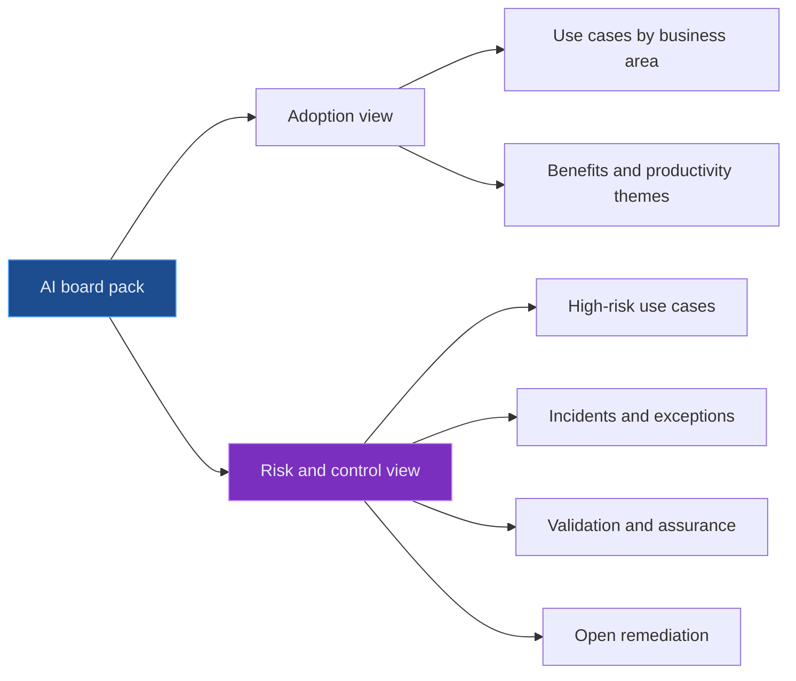

# Board Reporting for AI Risk and Model Risk Committees

Boards do not need to understand every model parameter, embedding strategy, or prompt engineering detail. They do need to understand whether AI is being used safely, whether material risks are controlled, and whether management has enough visibility to act.

Good AI risk reporting is not a glossy innovation update. It is a decision-support pack for oversight.

The board question is simple: **Are we using AI within our risk appetite, and can management prove it?**

---

## The Board Pack Should Separate Adoption From Control

Many AI dashboards show how many use cases exist. That is useful, but incomplete. Adoption without control is just exposure.

The report should show both.

This prevents a common problem: senior forums hearing only the success story.

---

## A Useful AI Risk Dashboard

| Metric | What it tells the board |
| --- | --- |
| AI use cases by risk tier | Whether material exposure is growing |
| High-risk use cases awaiting approval | Whether governance is being bypassed or delayed |
| AI incidents and near misses | Whether controls are failing in practice |
| Open validation findings | Whether material weaknesses remain unresolved |
| Vendor concentration | Whether dependency risk is building |
| Policy exceptions | Whether teams are operating outside appetite |
| Audit and assurance findings | Whether independent review supports management's view |
| Training and attestation coverage | Whether users understand obligations |

The dashboard should trend over time. A single snapshot is less useful than seeing whether risk is improving or deteriorating.

---

## What Model Risk Committees Need

Model risk committees need more detail than the board. Their focus should be challenge, approval, limitations, and monitoring.

| Committee question | Evidence needed |
| --- | --- |
| Is this AI use case a model or model-like system? | Model identification and classification |
| What tier is it? | Materiality assessment and rationale |
| Has it been independently reviewed? | Validation report or challenge note |
| What are the limitations? | Known limitation register |
| How is it monitored? | MI, thresholds, alerts, review frequency |
| What changed recently? | Change log for model, data, prompts, retrieval, vendor |
| Can it be stopped? | Kill switch, fallback, manual process |

The committee should not only approve models. It should also track whether approved AI remains within its intended use.

---

## A Simple RAG Status Model

Boards and committees need a quick way to see status without hiding nuance.

| Status | Meaning | Example action |
| --- | --- | --- |
| Green | Operating within appetite, no material overdue actions | Continue monitoring |
| Amber | Open issues, exceptions, or watchlist indicators | Management action plan |
| Red | Material control weakness, incident, or unacceptable risk | Escalation, restriction, or suspension |

RAG status should never be decorative. Every amber or red item should have an owner, due date, and decision needed.

---

## The Human Language Test

A board AI report should be readable by a non-technical but financially literate director. If it cannot explain the risk in plain language, the report is not ready.

Instead of:

> "Embedding drift increased beyond benchmark tolerance in vector recall."

Say:

> "The system is becoming less reliable at finding the right source documents. Until retrieval quality returns to threshold, outputs require additional human review."

That is not dumbing down. That is governance communication.

---

## Final Thought

AI board reporting should make three things visible: where AI is being used, where risk is building, and where management needs a decision.

The best reports do not overwhelm senior leaders with technical theatre. They give a clear, evidence-backed view of control.

That is what helps AI governance become real.

---

*Educational note: This article is for general research and learning. It is not board advisory, legal, regulatory, model validation, audit, compliance, or professional advice.*
