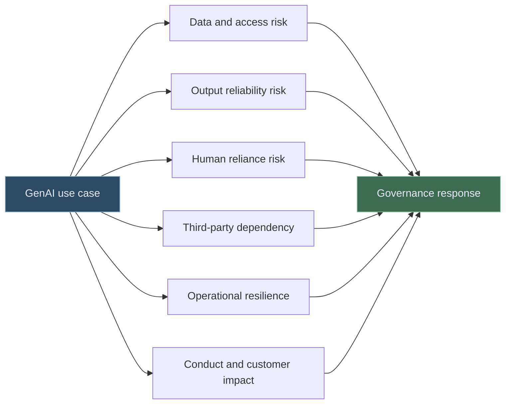
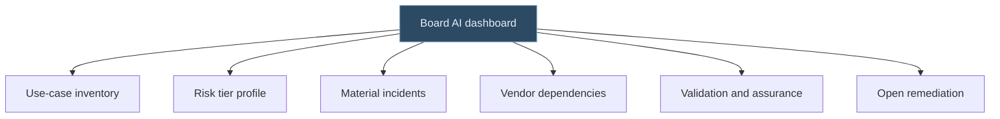

# ECB AI Supervision - Governance, GenAI, and Prudential Risk

The ECB's message on AI in banking is becoming clearer: innovation is welcome, but banks must remain in control.

That is a sensible supervisory posture. AI can improve productivity, risk detection, customer service, fraud monitoring, document analysis, and internal decision support. But it can also introduce operational fragility, explainability gaps, third-party dependency, data leakage, poor human oversight, and concentration risk.

The point is not whether banks should use AI. The point is whether AI is being absorbed into the bank's governance system before it becomes too important to understand.

---

## Why GenAI Changes the Supervisory Conversation

Traditional models usually have a defined output: a score, estimate, classification, forecast, or risk measure. Generative AI can produce text, code, reasoning traces, summaries, recommendations, and draft decisions.

That makes the control perimeter wider.

ECB Banking Supervision has flagged AI and generative AI as areas of ongoing attention in supervisory priorities and public commentary. The practical implication for banks is simple: AI should not sit outside risk governance just because it arrived through productivity tools, innovation labs, or vendor platforms.

---

## The Questions Banks Should Be Able to Answer

| Supervisory theme | Practical question |
| --- | --- |
| Strategy | How does AI fit into the bank's business and digital strategy? |
| Governance | Who approves, owns, and monitors AI use cases? |
| Risk management | How are AI risks identified, assessed, controlled, and reported? |
| Data | What data is used, and is it permitted for the use case? |
| Third parties | Which vendors or foundation models are relied on? |
| Human oversight | Where does human judgement remain mandatory? |
| Resilience | What happens if the model, provider, data source, or workflow fails? |

The uncomfortable answer "we do not know" is usually a sign that the inventory is not mature enough.

---

## A Practical ECB-Aligned AI Control Stack

Banks do not need a separate governance universe for AI. They need AI to connect into existing governance.

| Control layer | What it should cover |
| --- | --- |
| AI inventory | All material AI and GenAI use cases, including vendor tools |
| Risk tiering | Proportional control depth based on impact and complexity |
| Data governance | Permitted data, lineage, retention, access, confidentiality |
| Model risk | Validation, limitations, explainability, monitoring |
| Operational resilience | Fallbacks, incident handling, dependency mapping |
| Conduct and compliance | Customer impact, disclosure, conflicts, suitability where relevant |
| Board reporting | Material AI risks, incidents, exceptions, and remediation |

The key is connection. AI governance that is not linked to operational risk, model risk, compliance, data governance, and resilience will struggle under scrutiny.

---

## The Board View

Boards do not need to review every prompt template. They do need a clear view of material AI risk.

A useful board pack might show:

- Number of AI use cases by risk tier
- High-risk use cases and approval status
- GenAI use across critical business areas
- Exceptions to AI policy
- Material vendors and dependencies
- Incidents, near misses, and control breaches
- Validation status for high-impact models
- Audit or assurance findings

Good board reporting is not a celebration of AI adoption. It is a clear picture of AI control.

---

## Final Thought

The ECB's direction points toward mature, connected governance. Banks should be able to show that AI is understood, owned, risk-assessed, monitored, and challengeable.

That is a higher bar than "we have an AI policy." It requires operating evidence.

The institutions that do this well will not treat governance as a brake. They will treat it as the operating system that lets AI scale safely.

---

*Educational note: This article is for general research and learning. It is not legal, regulatory, prudential, compliance, model validation, audit, or professional advice.*
