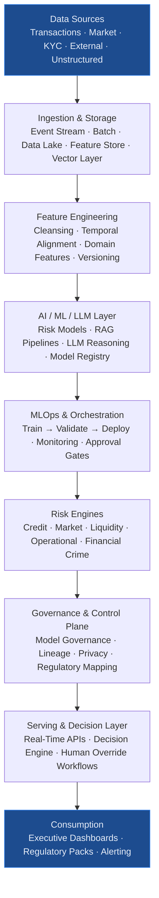
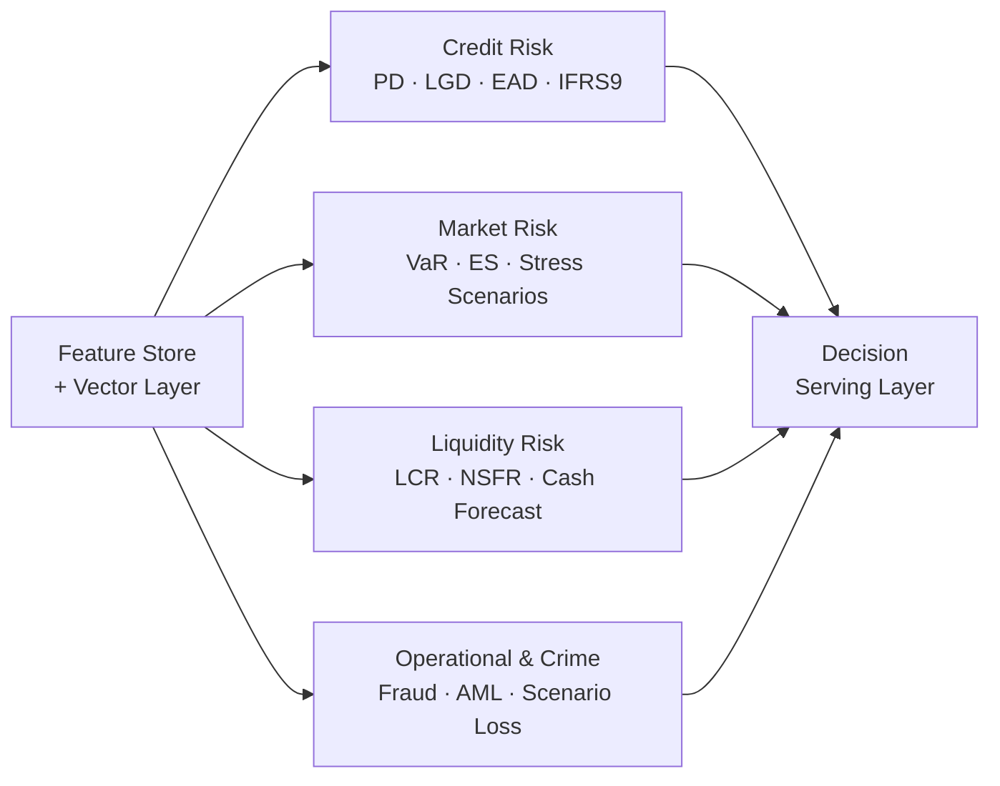
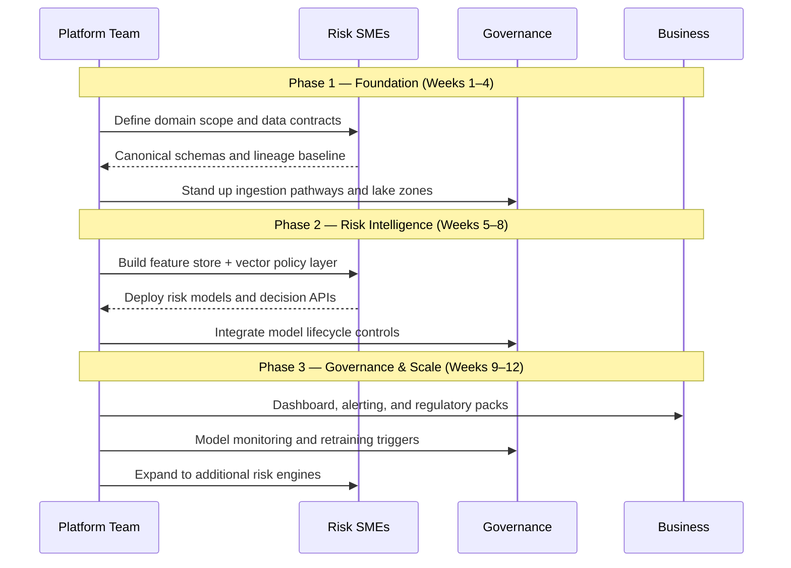

# End-to-End AI Risk Platform Architecture

A production blueprint for building a unified AI-native risk platform for modern banking and finance.

---

## Article Focus

- Written for: CRO teams, model risk teams, enterprise architects, risk engineering leaders, and platform owners
- Core objective: connect data, modeling, controls, and decisioning into one governed operating system

---

## Why Most Risk Stacks Fail at Scale

Many organisations have individual risk engines, separate data marts, and disconnected model pipelines. This usually creates:

- Inconsistent definitions across credit, market, liquidity, and operational risk
- Slow model deployment cycles due to fragmented handoffs
- Limited traceability from business decision back to model inputs and control evidence
- Duplication of infrastructure and governance controls across teams

The end-to-end platform model solves this by standardising data contracts, orchestration, governance, and serving paths across all risk domains.

---

## Reference Architecture

---

## Platform Layer Overview

---

## Architecture Breakdown (Layer by Layer)

### 1. Data Sources
- Core banking transactions: loans, deposits, repayments, payments
- Market feeds: rates, FX, spreads, equities, volatility signals
- Customer intelligence: KYC, behaviour, CRM, interaction history
- External intelligence: bureaus, sanctions, macroeconomic indicators, regulator publications
- Unstructured evidence: policies, legal agreements, credit memos, audit documentation

### 2. Data Ingestion and Storage
- Event-stream ingestion for low-latency risk signals
- Batch/API ingestion for scheduled and partner feeds
- Raw immutable data lake as legal-grade source of truth
- Curated data products and governed feature store for model reuse
- Vector data layer for policy retrieval and semantic compliance support

### 3. Data Processing and Feature Engineering
- Cleansing, validation, and conformance checks
- Temporal alignment for cross-source event consistency
- Domain feature generation (PD/LGD/EAD, VaR factors, liquidity stress factors)
- Feature versioning for reproducible model training and audits

### 4. AI / ML / LLM Layer
- Traditional risk models for scoring, detection, and forecasting
- LLM and RAG pipelines for policy reasoning, document insight, and controls copilots
- Model registry for approved versions and controlled promotion

### 5. MLOps and Orchestration
- Train/validate/deploy lifecycle with approval gates
- Workflow orchestration for scheduled and event-driven jobs
- Monitoring for drift, performance decay, and policy guardrail breaches

---

## Model Lifecycle and MLOps Loop

---

### 6. Risk Engines

- Credit risk engine (PD, LGD, EAD, IFRS 9-style outputs)
- Market risk engine (VaR, expected shortfall, stress scenarios)
- Liquidity risk engine (LCR, NSFR, cash forecasting)
- Operational and financial crime engines (fraud, AML, scenario loss analysis)

### 7. Governance and Regulatory Control Plane
- Model governance and independent challenge workflows
- End-to-end lineage and immutable audit trails
- Data privacy, access segregation, and control attestations
- Regulatory mapping to PRA, Basel, CRR/CRD, AML, and AI governance frameworks

---

## Governance and Decisioning Flow

---

### 8. Serving and Decision Layer
- Real-time and batch scoring APIs
- Decision engine combining risk outputs with policy rules
- Human override workflows with reason logging

### 9. Consumption and Reporting
- Executive and board dashboards
- Regulatory reporting packs
- Alerting for threshold breaches, drift, and control failures

---

## End-to-End Platform Flow

---

## What Makes This Architecture Enterprise-Grade

- Unified feature and data contracts across risk domains
- Shared governance plane instead of duplicated controls per team
- Clear separation between model execution and policy decisioning
- Traceability from board metric back to source records and model version
- Continuous monitoring tied to operating thresholds and remediation playbooks

---

## Vendor-Neutral Implementation Rule

Design the platform around capabilities, not products. For each layer, define:

- Functional requirement (what the layer must do)
- Non-functional requirement (latency, resilience, security, auditability)
- Interoperability contract (schemas, APIs, event formats, lineage fields)

This allows teams to swap tools over time without redesigning the operating model.

---

## Implementation Blueprint (90-Day Path)

---

## KPI Framework to Track Value

| KPI Category | Metric | Target |
| --- | --- | --- |
| Platform | Model deployment cycle time | < 5 business days |
| Platform | Decision lineage coverage | > 98% |
| Platform | Feature reuse rate across teams | > 60% |
| Risk Outcomes | Early-warning lead time improvement | +48h average |
| Risk Outcomes | Drift detection to remediation | < 24h |
| Compliance | Audit evidence completeness | > 99% |
| Compliance | Regulatory reporting cycle time | -40% reduction |

---

## Common Pitfalls and How to Avoid Them

| Pitfall | Risk | Mitigation |
| --- | --- | --- |
| Separate stacks per risk type | Fragmented governance, duplicated cost | Enforce shared platform standards early |
| Governance as post-processing | Control gaps that fail audit | Embed controls in every layer |
| Policy logic inside model code | Hard to update, impossible to audit | Externalise and version policy rules |
| Skipping operational readiness | No-one knows who responds to alerts | Define alert ownership and runbooks before launch |

---

## Final Thought

An end-to-end AI risk platform is not just a technology upgrade. It is an operating model shift that aligns risk analytics, AI delivery, governance, and executive decisioning on one production-grade foundation.
