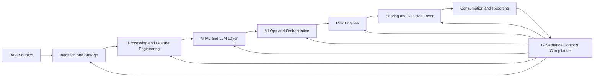
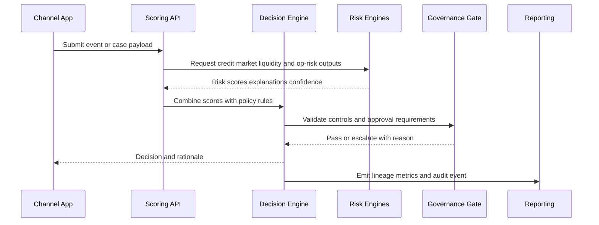
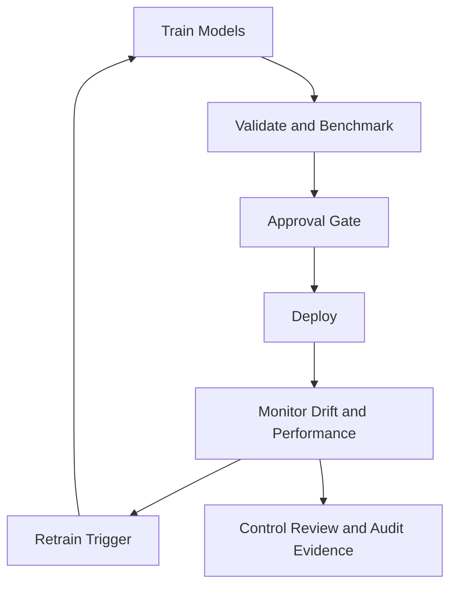

---
title: End-to-End AI Risk Platform Architecture
date: 2026-04-05
excerpt: A production blueprint for modern banking and finance risk platforms spanning data, AI/LLM pipelines, MLOps, governance, and decision serving.
tags:
  - Risk Platform
  - Banking
  - AI Architecture
---

# End-to-End AI Risk Platform Architecture

A production blueprint for building a unified AI-native risk platform for modern banking and finance.

---

## Article Focus

- Written for: CRO teams, model risk teams, enterprise architects, risk engineering leaders, and platform owners
- Core objective: connect data, modeling, controls, and decisioning into one governed operating system

---

## Why Most Risk Stacks Fail at Scale

Many organizations have individual risk engines, separate data marts, and disconnected model pipelines. This usually creates:

- Inconsistent definitions across credit, market, liquidity, and operational risk
- Slow model deployment cycles due to fragmented handoffs
- Limited traceability from business decision back to model inputs and control evidence
- Duplication of infrastructure and governance controls across teams

The end-to-end platform model solves this by standardizing data contracts, orchestration, governance, and serving paths across all risk domains.

---

## Reference Architecture (Visual)

---

## Architecture Breakdown (Layer by Layer)

### 1. Data Sources
- Core banking transactions: loans, deposits, repayments, payments
- Market feeds: rates, FX, spreads, equities, volatility signals
- Customer intelligence: KYC, behavior, CRM, interaction history
- External intelligence: bureaus, sanctions, macroeconomic indicators, regulator publications
- Unstructured evidence: policies, legal agreements, credit memos, audit documentation

### 2. Data Ingestion and Storage
- Event-stream ingestion for low-latency risk signals
- Batch/API ingestion for scheduled and partner feeds
- Raw immutable data lake as legal-grade source of truth
- Curated data products and governed feature store for model reuse
- Vector data layer for policy retrieval and semantic compliance support

### 3. Data Processing and Feature Engineering
- Cleansing, validation, and conformance checks
- Temporal alignment for cross-source event consistency
- Domain feature generation (PD/LGD/EAD, VaR factors, liquidity stress factors)
- Feature versioning for reproducible model training and audits

### 4. AI / ML / LLM Layer
- Traditional risk models for scoring, detection, and forecasting
- LLM and RAG pipelines for policy reasoning, document insight, and controls copilots
- Model registry for approved versions and controlled promotion

### 5. MLOps and Orchestration
- Train/validate/deploy lifecycle with approval gates
- Workflow orchestration for scheduled and event-driven jobs
- Monitoring for drift, performance decay, and policy guardrail breaches

### 6. Risk Engines
- Credit risk engine (PD, LGD, EAD, IFRS 9 style outputs)
- Market risk engine (VaR, expected shortfall, stress scenarios)
- Liquidity risk engine (LCR, NSFR, cash forecasting)
- Operational/financial crime engines (fraud, AML, scenario loss analysis)

### 7. Governance and Regulatory Control Plane
- Model governance and independent challenge workflows
- End-to-end lineage and immutable audit trails
- Data privacy, access segregation, and control attestations
- Regulatory mapping to PRA, Basel, CRR/CRD, AML, and AI governance frameworks

### 8. Serving and Decision Layer
- Real-time and batch scoring APIs
- Decision engine combining risk outputs with policy rules
- Human override workflows with reason logging

### 9. Consumption and Reporting
- Executive and board dashboards
- Regulatory reporting packs
- Alerting for threshold breaches, drift, and control failures

---

## End-to-End Platform Flow (Mermaid)

---

## Decisioning Flow (Operational)

---

## Model Lifecycle and Control Loop

---

## What Makes This Architecture Enterprise-Grade

- Unified feature and data contracts across risk domains
- Shared governance plane instead of duplicated controls per team
- Clear separation between model execution and policy decisioning
- Traceability from board metric back to source records and model version
- Continuous monitoring tied to operating thresholds and remediation playbooks

---

## Vendor-Neutral Implementation Rule

Design the platform around capabilities, not products. For each layer, define:

- Functional requirement (what the layer must do)
- Non-functional requirement (latency, resilience, security, auditability)
- Interoperability contract (schemas, APIs, event formats, lineage fields)

This allows teams to swap tools over time without redesigning the operating model.

---

## Implementation Blueprint (90-Day Path)

### Phase 1: Foundation (Weeks 1-4)
- Define target operating model and risk-domain scope
- Establish canonical data contracts and lineage baseline
- Stand up ingestion pathways and raw/curated lake zones

### Phase 2: Risk Intelligence (Weeks 5-8)
- Build reusable feature store and vector-enabled policy layer
- Deploy initial risk models and decision APIs
- Integrate model lifecycle controls and approval workflows

### Phase 3: Governance and Scale (Weeks 9-12)
- Implement dashboard, alerting, and regulatory evidence packs
- Enable model monitoring and retraining triggers
- Expand to additional risk engines and business units

---

## KPI Framework to Track Value

### Platform KPIs
- Time from model approval to production deployment
- Percentage of decisions with complete lineage and rationale
- Reuse rate of governed features across risk teams

### Risk Outcome KPIs
- Early-warning lead time improvement
- Drift detection to remediation turnaround
- Reduction in policy exceptions and manual overrides

### Compliance KPIs
- Audit evidence completeness rate
- Regulatory reporting cycle time
- Number of unresolved control findings

---

## Common Pitfalls and How to Avoid Them

- Building separate stacks by risk type: enforce shared platform standards early
- Treating governance as post-processing: embed controls in every layer
- Mixing policy logic into model code: keep decision policy externalized and versioned
- Skipping operational readiness: define alert ownership and response runbooks before launch

---

## Final Thought

An end-to-end AI risk platform is not just a technology upgrade. It is an operating model shift that aligns risk analytics, AI delivery, governance, and executive decisioning on one production-grade foundation.
