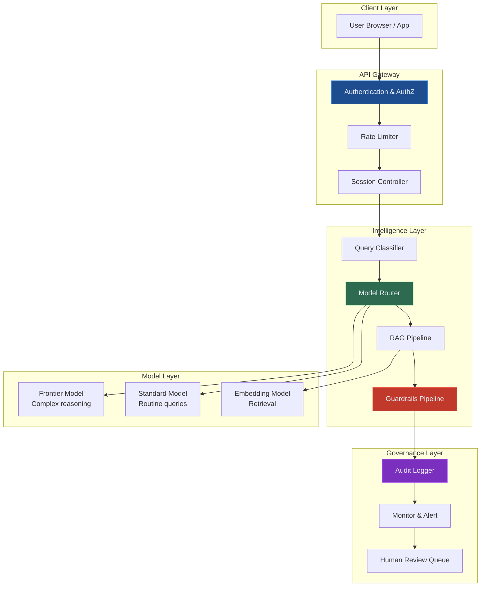
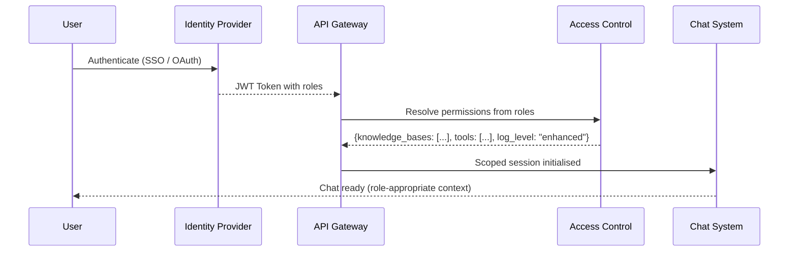
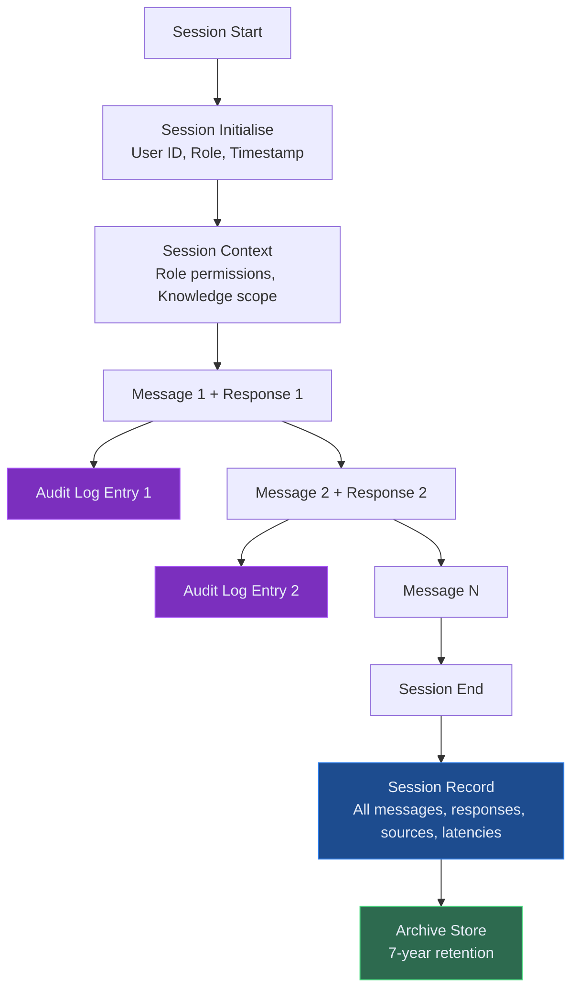
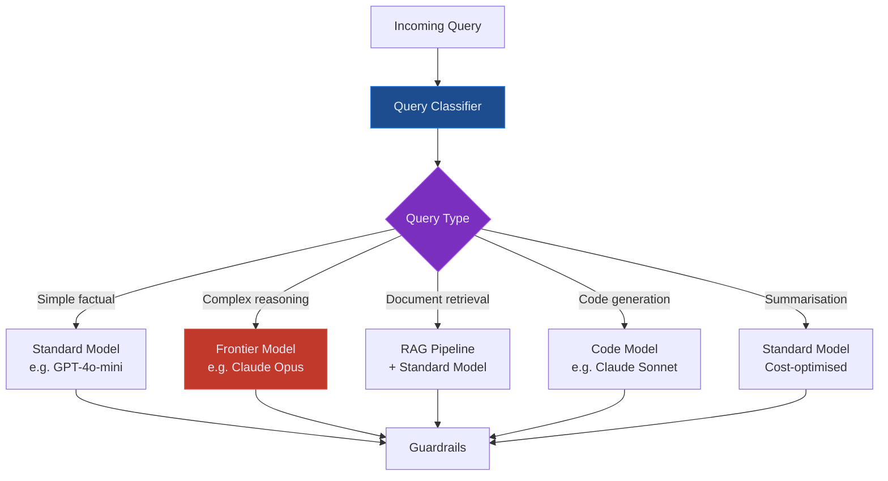
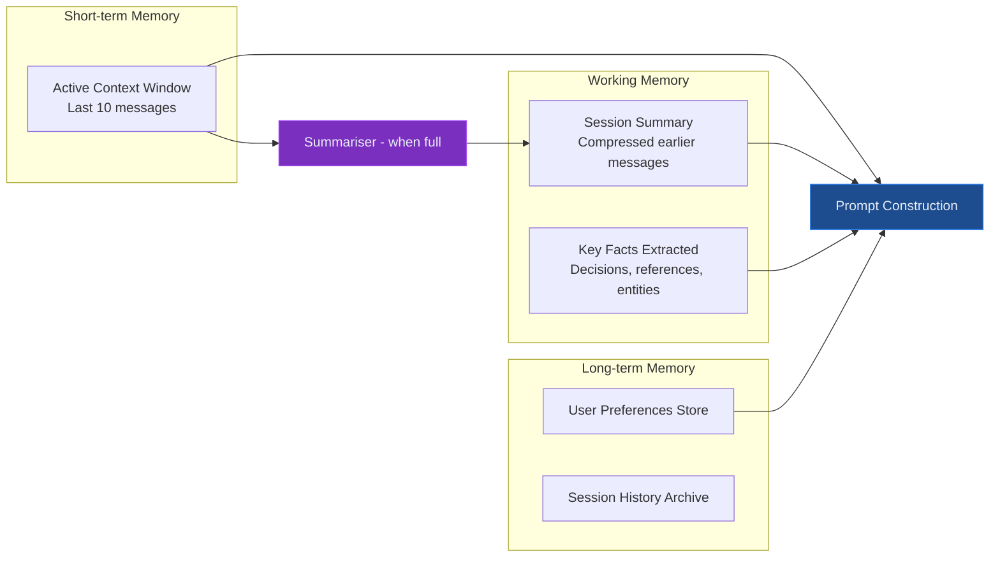
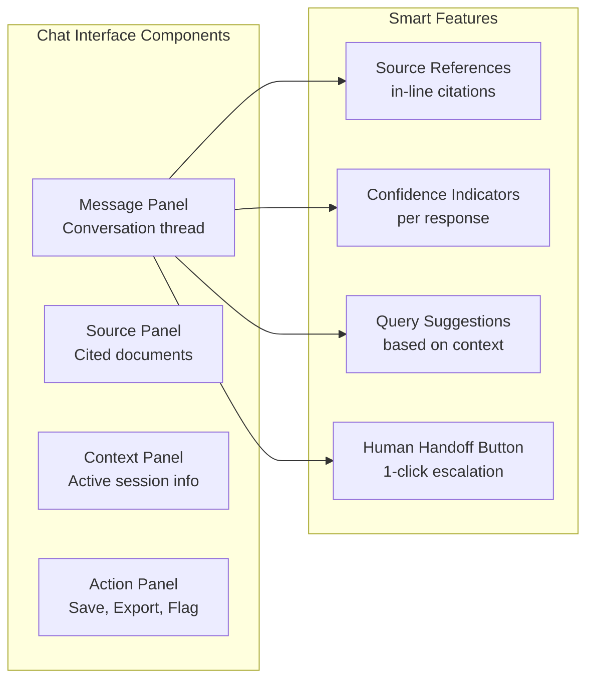
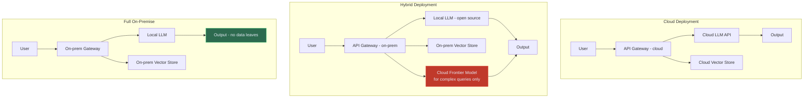

# Enterprise LLM Chat Interfaces

Building production-aware AI chat interfaces for regulated industries — authentication, audit trails, multi-model routing, session governance, and compliance-by-design.

---

## Consumer Chat vs Enterprise Chat

ChatGPT is a consumer product. It is stateless between sessions, has no role-based access, logs nothing for your audit team, routes all queries to a single model, and has no domain-specific knowledge controls.

Enterprise LLM chat is a fundamentally different product. It must be:

- **Identity-aware** — responses differ by user role (analyst vs authorised reviewer vs board)
- **Auditable** — every message, every response, every source logged immutably
- **Domain-scoped** — the system answers within its defined knowledge boundary
- **Multi-model** — different query types route to different models for quality and cost
- **Governable** — administrators can monitor, pause, or override sessions in real time
- **Compliant** — outputs respect regulatory boundaries without exception

The gap between a consumer chat wrapper and an enterprise-grade LLM interface is significant. This article covers the architecture that closes it.

---

## Enterprise Chat Architecture

---

## Authentication and Role-Based Access

Every enterprise chat system must authenticate users and map their identity to an access profile that determines:

- **Which knowledge bases they can query** (a junior analyst cannot query board-level ALCO data)
- **Which tools the AI can invoke on their behalf** (a read-only user should not trigger write actions)
- **Which response level they receive** (executive summaries vs full technical detail)
- **What audit trail is generated** (SMCR-regulated senior managers need enhanced logging)

**Role profiles for a banking conceptual deployment:**

| Role | Knowledge Access | Tools | Log Level |
|---|---|---|---|
| Compliance Analyst | Regulatory library, internal controls | Read-only | Standard |
| Senior Compliance Officer | All above + enforcement history | Read + draft | Enhanced |
| MLRO | All above + SAR database | Read + submit | Full + immutable |
| Board Member | Executive summaries only | Read-only | Standard |

---

## Session Governance

Sessions in enterprise chat are not ephemeral. They carry compliance significance.

Every session record must capture:
- User identity and role at session start
- Full message and response history
- Source documents cited in each response
- Model version and parameters used
- Guardrail decisions (what was flagged/blocked/redirected)
- Latencies and confidence scores
- Any human override events

This is the evidence bundle that satisfies public record-keeping materials and NHS information governance audits.

---

## Multi-Model Routing

Not all queries need a frontier model. Intelligent routing reduces cost by 40–70% without quality degradation.

**Routing logic for a public-framework mapping assistant:**

- "What is the LCR minimum requirement?" → Standard model (simple factual, retrievable)
- "Analyse our model risk governance against public model-risk materials and identify gaps" → Frontier model (multi-step reasoning)
- "Summarise this 40-page ALCO pack" → Standard model with document context
- "Draft a remediation plan for our identified Basel IV gaps" → Frontier model (complex generation)

---

## Context and Memory Management

LLM context windows are finite. Long enterprise conversations — a compliance review session that spans 40 exchanges — will exceed even 200k-token contexts. Memory management ensures continuity without degradation.

**Compression strategy**: when the active context approaches 80% capacity, a lightweight LLM compresses the oldest 50% of the conversation into a summary paragraph, preserving key facts (regulatory references cited, decisions made, entities mentioned) while discarding verbatim exchange. The summary is injected into the system context for all future turns.

---

## Domain-Specific UI Patterns

Enterprise chat is not just a text box. The interface should reflect the domain context.

**Key UI patterns for regulated industries:**

**In-line citations** — every factual claim links to the source document, section, and page. Users can click to verify. This is essential for authorised reviewer adoption.

**Confidence indicators** — a visual signal when the system is less certain (amber/red) vs highly confident (green). Trains users to verify borderline answers.

**Human handoff button** — one click sends the conversation thread to a specialist. The specialist sees the full context, the sources consulted, and the AI's reasoning. Critical for healthcare operations and compliance escalations.

**Session export** — export the full session (questions, answers, citations) as a formatted PDF or structured JSON for regulatory evidence purposes.

---

## Compliance by Design: FCA and NHS Requirements

### Public conduct and accountability materials
- All AI-assisted decisions by Senior Managers must be logged with the AI's output and the human's final decision
- The "why" behind AI recommendations must be explainable and retrievable
- Records must be retained for at minimum 7 years
- Material model changes (prompt updates that change answer patterns) require model risk review

### Healthcare information governance considerations
- PII must never leave the approved healthcare network boundary — on-premise or private cloud conceptual deployment required for patient-related queries
- Access logs must be reviewed quarterly by the Information Asset Owner
- Any clinical advice boundary breach must be reported as a data quality incident
- System must have a named clinical safety lead and a clinical safety case documentation

---

## Deployment Patterns: Cloud vs On-Premise

**Healthcare information-governance consideration**: patient-identifiable data must not leave approved healthcare infrastructure. Full on-premise or approved private healthcare cloud conceptual deployment is required for any system that processes patient records. LorvexAI's Healthcare Flow Intelligence blueprint supports both hybrid (anonymised queries to cloud LLM, PII stays on-prem) and full on-premise conceptual deployment.

---

## Getting Started

Building an enterprise chat interface from scratch is a 12–16 week project. The fastest path to a reviewable prototype:

1. Start with an existing open-source chat framework (Open WebUI, LibreChat) as the UI layer
2. Add SSO authentication via your existing identity provider
3. Wire in your RAG pipeline as the knowledge backend
4. Implement audit logging to your existing SIEM or data warehouse
5. Add guardrails as a middleware layer before responses reach the user
6. Pilot with a single team, collect feedback, tune before wider rollout

The LorvexAI platform accelerates this to 4 weeks by providing pre-built modules for each layer, pre-configured for your regulatory domain.

---

*Want to see an enterprise chat interface running on your own regulatory knowledge base? [Book a demo](/contact) with the LorvexAI team.*
