---
title: Enterprise RAG Architectures
date: 2026-03-30
excerpt: Designing retrieval-augmented generation systems for reliability, governance, and production-grade intelligence at scale.
tags:
  - RAG
  - LLM Engineering
  - Architecture
---

# Enterprise RAG Architectures

Designing retrieval-augmented generation systems for reliability, governance, and production-grade intelligence at scale.

---

## Article Focus

- Written for: technology architecture teams, finance risk/compliance teams, healthcare knowledge-platform teams, and NHS digital transformation teams
- Primary value: trusted retrieval and decision support with measurable governance

---

## Why Enterprise RAG Is Different

A production-grade Retrieval-Augmented Generation stack is not just "LLM + vector DB." In enterprise environments, every answer must be:

- Grounded in approved internal knowledge
- Enforced by role and policy controls before answer generation
- Observable with quality, latency, and cost SLAs
- Auditable for compliance and model risk governance

---

## Five-Layer Architecture Blueprint

### 1. Ingestion and Knowledge Processing
- Structured, semi-structured, and unstructured data pipelines
- ACL, PII, and policy tagging at ingestion
- Small-to-large chunking (child chunks for search, parent docs for final context)

### 2. Pre-Retrieval Intelligence
- Query rewriting and expansion for underspecified prompts
- HyDE generation to create stronger semantic search vectors
- Retrieval route planning by intent and policy constraints

### 3. Retrieval and Relevance
- ACL gatekeeper before results are exposed to orchestration
- Hybrid retrieval (BM25 + vector)
- Cross-encoder reranking to optimize relevance over similarity-only ranking

### 4. Orchestration and Agentic Reasoning
- Context packaging with citation links and parent passages
- ReAct loops: model can trigger re-search when evidence confidence is low
- Policy-aware tool use and escalation logic

### 5. Generation, Trust, and Evaluation
- Structured, citation-first responses
- Policy and safety verification before final delivery
- Continuous evaluation harness with Ragas and TruLens metrics

---

## Architecture Diagram (Business + Platform View)

---

## Engineering Flow Diagram (Detailed Technical View)

---

## Mermaid Source-of-Truth (Implementation View)

```mermaid
flowchart LR
  U["User Query"] --> PR1["Query Rewrite"]
  PR1 --> PR2["HyDE Generation"]
  PR2 --> GATE["ACL Gatekeeper"]
  GATE --> RET["Hybrid Retrieval (BM25 + Vector)"]
  RET --> RR["Cross-Encoder Reranker"]
  RR --> CB["Context Builder (Parent Passages + Citations)"]
  CB --> ORCH["Agent Orchestrator (ReAct)"]
  ORCH --> GEN["LLM Generation"]
  GEN --> PV["Policy + Safety Verifier"]
  PV --> OUT["Cited Response"]
  OUT --> EVAL["Ragas + TruLens Evaluation"]
  EVAL --> FB["Feedback Loop"]
  FB --> PR1
  ORCH --> RET
```

---

## Design Principles for Production RAG

- Treat retrieval as a first-class system, not a utility call
- Separate pre-retrieval, retrieval, orchestration, and trust concerns
- Enforce ACL and policy checks before and after generation
- Prefer evidence-backed, structured answers over fluent but unverifiable output
- Build closed-loop evaluation from live traffic and reviewer feedback

---

## Key Enterprise Metrics

### Retrieval and Relevance
- Recall at k, nDCG, and reranker lift
- Citation coverage and context precision
- Freshness lag from source update to retrievable index

### Generation and Trust
- Faithfulness and groundedness
- Answer relevance and task completion quality
- Policy violation rate and abstention accuracy

### Reliability and Cost
- p95 latency by route
- Cost per answered query and per successful task
- Failure, fallback, and escalation rates

### Evaluation Frameworks to Operationalize
- Ragas: answer relevance, faithfulness, context precision
- TruLens: trace-level quality and groundedness instrumentation

---

## Vector Database Options and Comparison

| Option | Search Type | Best Fit | Strengths | Tradeoffs |
| --- | --- | --- | --- | --- |
| Pinecone | Hybrid support (keyword + vector) | Managed enterprise deployments | Fast setup, managed scaling, mature ecosystem | Higher managed cost at larger scale |
| Weaviate | Hybrid support (keyword + vector) | Teams needing rich filtering and schema controls | Strong filter model and modular architecture | Needs careful tuning at high scale |
| Qdrant | Hybrid support (keyword + vector) | High-performance, cost-aware production | Excellent vector performance and payload filtering | Fewer managed enterprise features out of the box |
| Milvus | Hybrid via surrounding search stack | Large-scale self-hosted workloads | High throughput and horizontal scaling | Operational complexity if self-managed |
| pgvector (PostgreSQL) | Hybrid via SQL + lexical patterns | Teams standardizing on Postgres | Transactional + vector in one platform | Can be costly for very large retrieval workloads |
| OpenSearch / Azure AI Search | Native hybrid search | Existing enterprise search platform users | Familiar stack and operational integration | Relevance tuning depth varies by platform |

### Selection Heuristics
- Treat hybrid search as mandatory for enterprise-grade retrieval quality.
- Validate with your own corpus: recall quality, filter behavior, reranker lift, and p95 latency.
- Choose managed-first for speed, self-hosted when residency and control are dominant.

---

## Agentic RAG: From Chains to Adaptive Agents

Enterprise RAG is shifting from fixed chains to adaptive agents that can reason about evidence quality. A practical pattern:

1. Retrieve initial evidence.
2. Score confidence and grounding quality.
3. Re-plan and retrieve again when confidence is below threshold.
4. Finalize only after policy and evidence checks pass.

This ReAct loop improves answer robustness for ambiguous, multi-document enterprise queries.

---

## Common Failure Modes and Mitigations

### Failure Mode: Retrieval misses critical context
- Cause: weak metadata, poor chunk granularity, no query expansion
- Mitigation: schema-aware chunking, rewrite + HyDE, hybrid retrieval, reranking

### Failure Mode: Fluent but ungrounded responses
- Cause: weak context package or missing citation policy
- Mitigation: citation-required output, groundedness checks, abstain policy

### Failure Mode: Policy leakage
- Cause: ACL checks applied too late in pipeline
- Mitigation: gatekeeper enforcement before retrieval results reach orchestration

---

## Finance Example (Regulatory Intelligence)

### Pattern
- Hybrid retrieval across policy text and controls data
- Graph links from regulation -> process -> control owner
- Structured responses with source paragraph citations

### Example Query
Explain variance in liquidity coverage ratio and cite relevant internal policy clauses.

---

## Healthcare Example (Clinical Knowledge Assistant)

### Pattern
- Temporal retrieval with date-aware ranking
- Safety guardrails for contraindications
- Human review escalation on low-confidence outputs

### Example Query
Suggest treatment adjustments for a diabetic patient with declining renal function using the latest approved protocol.

---

## Implementation Roadmap

1. Start with one high-value workflow and explicit acceptance metrics
2. Define ingestion contracts and metadata/ACL taxonomy
3. Implement pre-retrieval loop + hybrid retrieval + reranker
4. Add agentic re-search loop and policy verifier
5. Stand up Ragas and TruLens evaluation harnesses
6. Launch shadow testing, canary rollout, and feedback-driven tuning

---

## Final Thought

Enterprise RAG requires moving beyond basic vector search into a modular five-layer system integrating intelligent ingestion, hybrid retrieval, agentic reasoning, and measurable trust controls.
