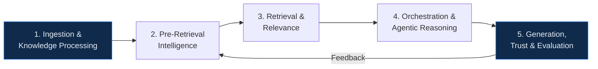
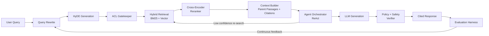
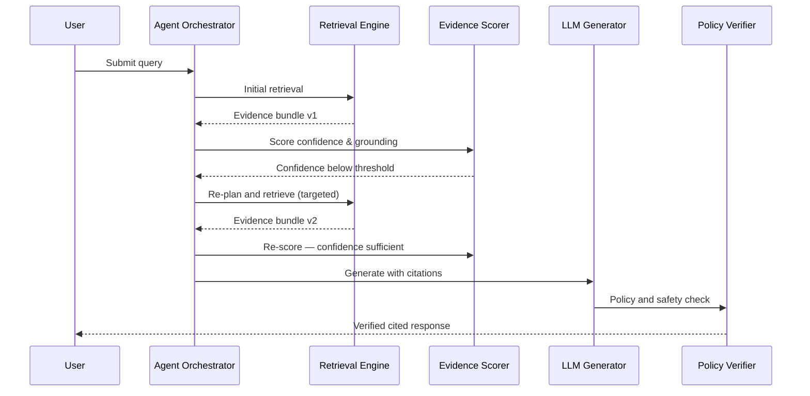
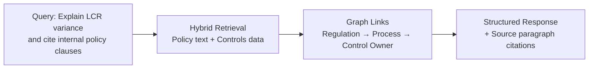
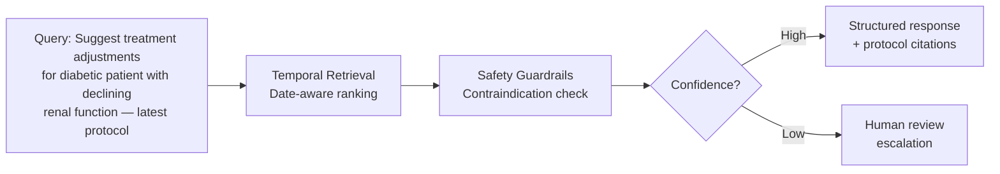

# Enterprise RAG Architectures

Designing retrieval-augmented generation systems for reliability, governance, and production-grade intelligence at scale.

---

## Article Focus

- Written for: technology architecture teams, finance risk/compliance teams, healthcare knowledge-platform teams, and NHS digital transformation teams
- Primary value: trusted retrieval and decision support with measurable governance

---

## Why Enterprise RAG Is Different

A production-grade Retrieval-Augmented Generation stack is not just "LLM + vector DB." In enterprise environments, every answer must be:

- Grounded in approved internal knowledge
- Enforced by role and policy controls before answer generation
- Observable with quality, latency, and cost SLAs
- Auditable for compliance and model risk governance

---

## Five-Layer Architecture Blueprint

### 1. Ingestion and Knowledge Processing
- Structured, semi-structured, and unstructured data pipelines
- ACL, PII, and policy tagging at ingestion
- Small-to-large chunking (child chunks for search, parent docs for final context)

### 2. Pre-Retrieval Intelligence
- Query rewriting and expansion for underspecified prompts
- HyDE generation to create stronger semantic search vectors
- Retrieval route planning by intent and policy constraints

### 3. Retrieval and Relevance
- ACL gatekeeper before results are exposed to orchestration
- Hybrid retrieval (BM25 + vector)
- Cross-encoder reranking to optimise relevance over similarity-only ranking

### 4. Orchestration and Agentic Reasoning
- Context packaging with citation links and parent passages
- ReAct loops: model can trigger re-search when evidence confidence is low
- Policy-aware tool use and escalation logic

### 5. Generation, Trust, and Evaluation
- Structured, citation-first responses
- Policy and safety verification before final delivery
- Continuous evaluation harness with relevance, faithfulness, and context-precision metrics

---

## Architecture Diagram (Business + Platform View)

---

## Engineering Flow Diagram (Detailed Technical View)

---

## Retrieval and Governance Flow

---

## Implementation Flow (Mermaid)

---

## Design Principles for Production RAG

- Treat retrieval as a first-class system, not a utility call
- Separate pre-retrieval, retrieval, orchestration, and trust concerns
- Enforce ACL and policy checks before and after generation
- Prefer evidence-backed, structured answers over fluent but unverifiable output
- Build closed-loop evaluation from live traffic and reviewer feedback

---

## Governance Loop

---

## Key Enterprise Metrics

### Retrieval and Relevance
- Recall at k, nDCG, and reranker lift
- Citation coverage and context precision
- Freshness lag from source update to retrievable index

### Generation and Trust
- Faithfulness and groundedness
- Answer relevance and task completion quality
- Policy violation rate and abstention accuracy

### Reliability and Cost
- p95 latency by route
- Cost per answered query and per successful task
- Failure, fallback, and escalation rates

---

## Vector Database Options and Comparison

| Option | Search Type | Best Fit | Strengths | Tradeoffs |
| --- | --- | --- | --- | --- |
| Managed vector platform | Hybrid (keyword + vector) | Speed to production | Fast setup, lower ops burden | Higher cost at scale |
| Schema-first retrieval platform | Hybrid (keyword + vector) | Rich filtering and metadata | Strong retrieval governance | Requires careful index tuning |
| Performance-optimised vector engine | Hybrid (keyword + vector) | High-throughput, cost-aware | Excellent vector performance | Managed features vary by provider |
| Self-hosted distributed vector stack | Hybrid via surrounding search | Large-scale, high-control | Strong horizontal scaling | Higher operational complexity |
| Relational DB with vector extension | Hybrid via SQL + lexical | Teams on relational platforms | Unified transactional + vector | Can be expensive at large scale |
| Enterprise search with vector support | Native hybrid search | Teams in enterprise search | Familiar stack + integration | Relevance tuning depth varies |

**Selection heuristics:** Treat hybrid search as mandatory. Validate with your own corpus. Choose managed-first for speed, self-hosted when residency and control dominate.

---

## Agentic RAG: From Chains to Adaptive Agents

Enterprise RAG is shifting from fixed chains to adaptive agents that reason about evidence quality:

1. Retrieve initial evidence.
2. Score confidence and grounding quality.
3. Re-plan and retrieve again when confidence is below threshold.
4. Finalise only after policy and evidence checks pass.

---

## Common Failure Modes and Mitigations

| Failure Mode | Cause | Mitigation |
| --- | --- | --- |
| Retrieval misses critical context | Weak metadata, poor chunking, no query expansion | Schema-aware chunking, rewrite + HyDE, hybrid retrieval, reranking |
| Fluent but ungrounded responses | Weak context package or missing citation policy | Citation-required output, groundedness checks, abstain policy |
| Policy leakage | ACL checks applied too late in pipeline | Gatekeeper enforcement before results reach orchestration |

---

## Finance Example (Regulatory Intelligence)

---

## Healthcare Example (Clinical Knowledge Assistant)

---

## Implementation Roadmap

1. Start with one high-value workflow and explicit acceptance metrics
2. Define ingestion contracts and metadata/ACL taxonomy
3. Implement pre-retrieval loop + hybrid retrieval + reranker
4. Add agentic re-search loop and policy verifier
5. Stand up evaluation harnesses for relevance, faithfulness, and groundedness
6. Launch shadow testing, canary rollout, and feedback-driven tuning

---

## Final Thought

Enterprise RAG requires moving beyond basic vector search into a modular five-layer system integrating intelligent ingestion, hybrid retrieval, agentic reasoning, and measurable trust controls.
