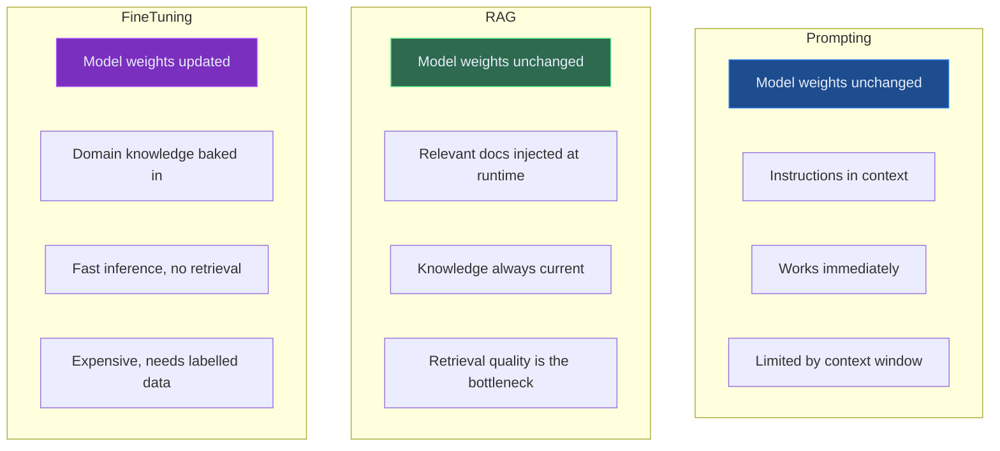
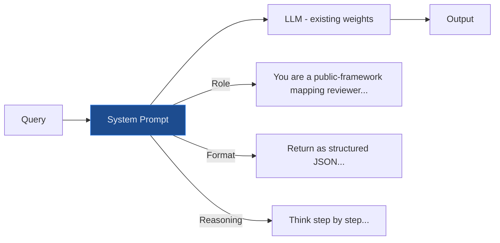
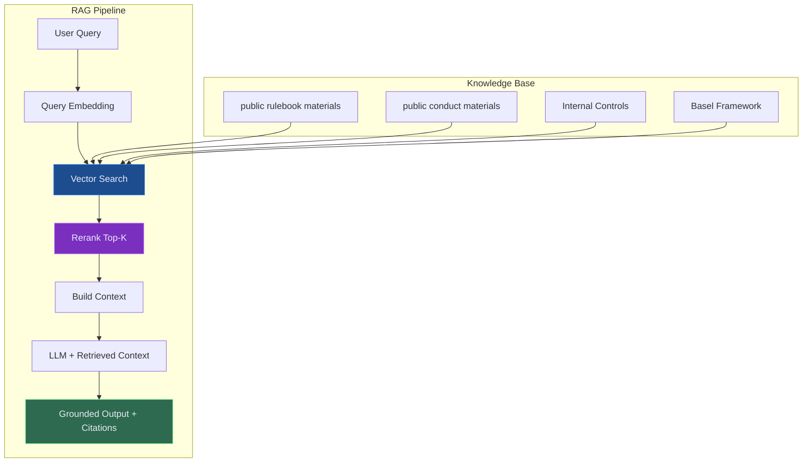
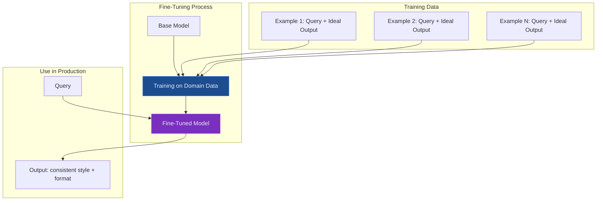
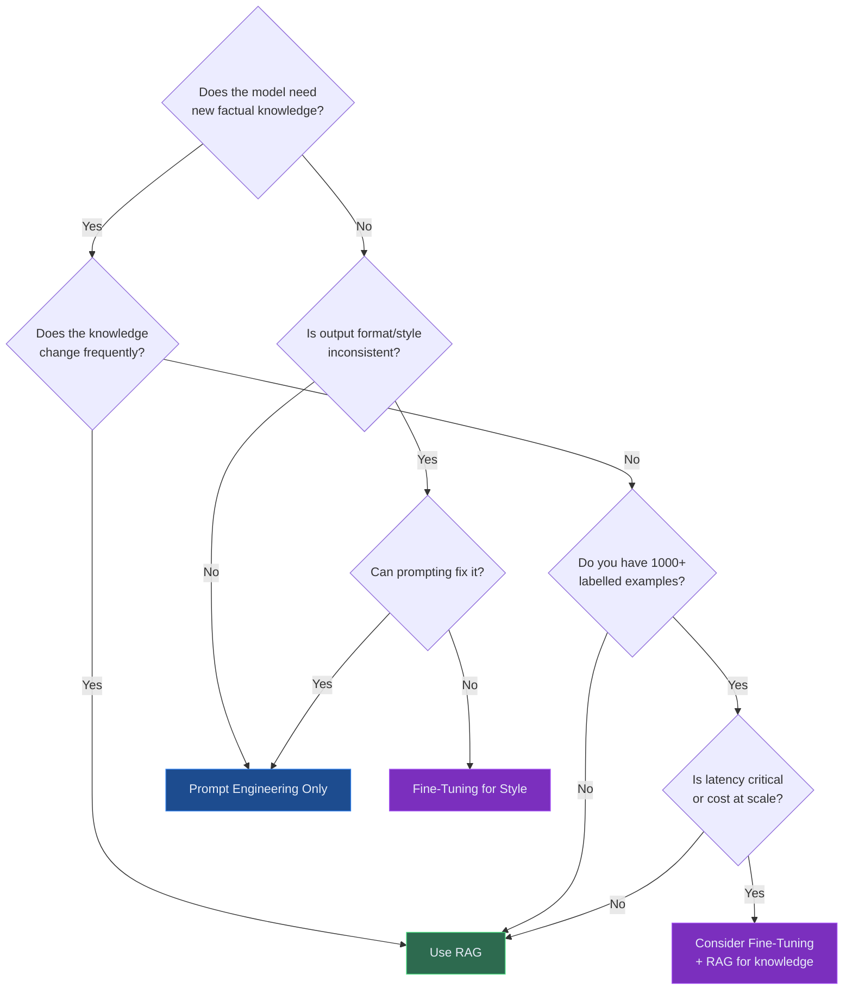
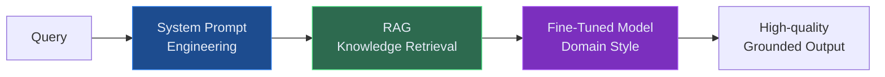

# Fine-Tuning vs RAG vs Prompting — Choosing the Right Approach

A practical decision framework for choosing between prompt engineering, retrieval-augmented generation, and fine-tuning for enterprise AI conceptual conceptual deployments in regulated industries.

---

## The Decision That Shapes Everything

The most consequential technical decision in an enterprise AI project is often made too quickly: how do you get the model to produce the output you need?

Three approaches dominate:

- **Prompt engineering** — craft instructions that guide the model's existing knowledge
- **RAG (Retrieval-Augmented Generation)** — inject relevant external documents at query time
- **Fine-tuning** — update the model's weights with domain-specific training data

Each has a different cost profile, capability profile, and risk profile. Getting this wrong wastes months of engineering effort and produces a system that either fails silently or fails expensively.

---

## Visual Overview: The Three Approaches

---

## When to Use Each Approach

### Prompt Engineering — Start Here, Always

Prompt engineering is the baseline. Before considering RAG or fine-tuning, exhaust what prompting can achieve. It requires no infrastructure, no training data, and can be iterated in hours.

**Best for:**
- Formatting and structure control (output as JSON, tables, bullet lists)
- Tone and persona (formal regulatory language, clinical brevity)
- Chain-of-thought reasoning (step-by-step governance analysis)
- Task decomposition (breaking a complex question into sub-queries)
- Role assignment (acting as a public-framework mapping reviewer)

**Limitations:**
- Cannot add factual knowledge the model doesn't have
- Cannot handle documents larger than the context window
- Inconsistent across model updates (prompt that works on GPT-4o may break on GPT-4o-mini)
- No audit trail of what knowledge was used

**Prompt engineering decision**: if your task requires the model to be smarter, better reasoned, or better formatted — prompting. If it requires the model to know things it doesn't know — you need RAG or fine-tuning.

---

### RAG — The Right Default for Enterprise Knowledge

RAG is the right approach for **most enterprise AI use cases** involving proprietary or frequently-updated knowledge: regulatory libraries, clinical guidelines, internal policies, customer records, market data.

**Best for:**
- Large, frequently updated document corpora (regulations, guidelines, policies)
- Situations where every answer must cite its source
- Reducing hallucination on factual queries
- Knowledge that changes faster than you can retrain (new regulatory circulars)
- Audit trail requirements (retrieve + log = provenance)

**Limitations:**
- Only as good as what's in the knowledge base
- Retrieval failures lead to answer failures
- Adds latency (retrieval + reranking + generation)
- Requires ongoing knowledge base maintenance

**RAG decision**: if the knowledge exists in documents you own and trust, and queries are primarily about retrieving and reasoning over that knowledge — RAG.

---

### Fine-Tuning — Targeted, Expensive, Powerful

Fine-tuning updates the model's weights using domain-specific training data, teaching it to produce specific types of outputs consistently. It is not primarily about adding factual knowledge (RAG does that better) — it is about changing **behaviour, style, and output format**.

**Best for:**
- Consistent output format (structured regulatory reports, clinical summaries)
- Domain tone and vocabulary (regulatory English, clinical language)
- Latency-critical paths where retrieval overhead is too slow
- Teaching the model specialised reasoning patterns (e.g., always map obligation → control → evidence)
- Reducing prompt length for cost optimisation at scale

**When NOT to fine-tune:**
- When the knowledge changes frequently (fine-tuned weights go stale)
- When you need citeable sources (fine-tuning doesn't give you provenance)
- When you have fewer than ~1,000 high-quality training examples
- When prompting or RAG hasn't been exhausted first

**Cost reality**: fine-tuning a frontier model costs thousands of pounds, takes days, and requires a curated labelled dataset. It should be a considered decision, not a first resort.

---

## The Decision Framework

---

## Combining Approaches: The Hybrid Stack

In practice, controlled systems use all three together:

**Reference blueprint approach for regulatory intelligence:**
1. **Prompt engineering** — role assignment (public-framework mapping reviewer), reasoning format (obligation → control → gap → recommendation), output structure (JSON + narrative)
2. **RAG** — retrieves the precise regulatory text, internal controls inventory, and evidence documents for each query
3. **Fine-tuning** — a domain-adapted model trained on 2,400 examples of regulatory mapping outputs, ensuring consistent evidence-oriented language and report structure

The result: a system where factual accuracy comes from RAG (with citations), consistent quality comes from fine-tuning, and reasoning depth comes from prompt engineering.

---

## Cost and Effort Comparison

| Dimension | Prompting | RAG | Fine-Tuning |
|---|---|---|---|
| **Setup time** | Hours | Days–Weeks | Weeks–Months |
| **Engineering effort** | Low | Medium–High | High |
| **Labelled data required** | None | None | 500–10,000+ examples |
| **Knowledge freshness** | Stale (training cutoff) | Live | Stale (training date) |
| **Source citation** | No | Yes | No |
| **Inference cost** | Baseline | Baseline + retrieval | Lower per-token |
| **Regulatory auditability** | Low | High | Medium |

---

## Recommendation for Regulated Enterprises

Start with **RAG + prompt engineering**. This gets you to production with:
- Grounded, citable answers
- Live knowledge (updated as regulations change)
- Full audit trail
- No training data required

Add **fine-tuning** only when you have:
- A stable, well-defined output format that prompting doesn't reliably produce
- High query volume making inference cost a concern
- A curated, high-quality labelled dataset from domain experts
- A model risk process for the fine-tuned model (it is a model, and therefore in scope for public model-risk materials)

---

*Unsure which approach fits your use case? [Book a technical consultation](/contact) — we'll map the right architecture for your data, your governance considerations, and your timeline.*
