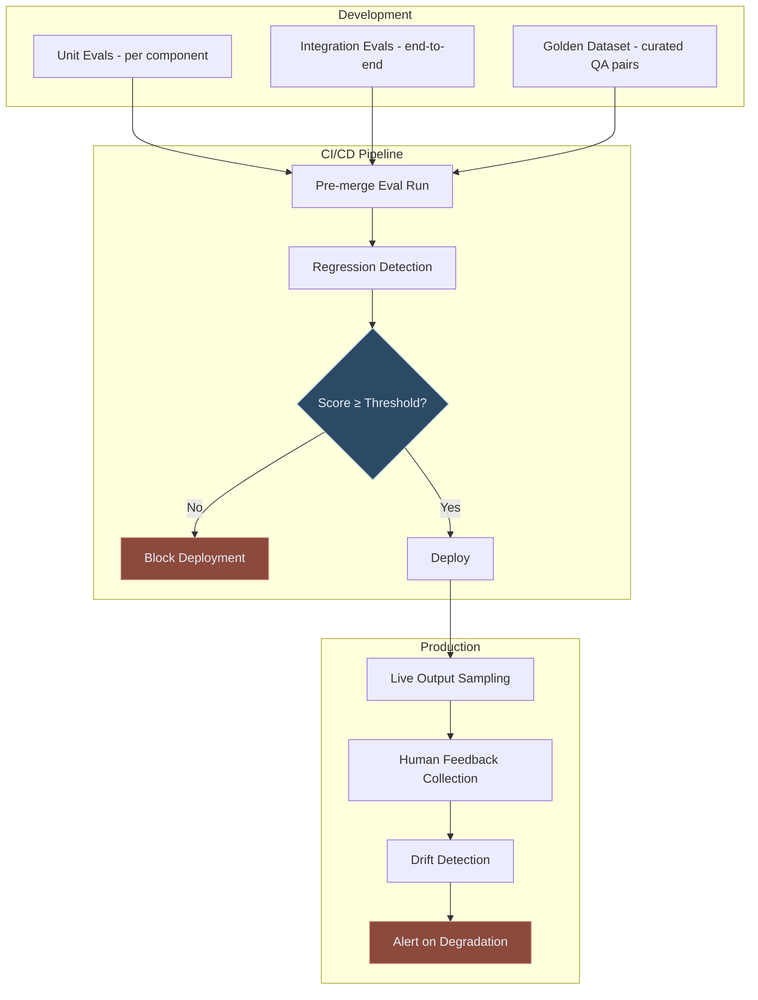
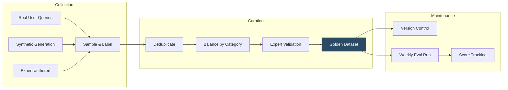
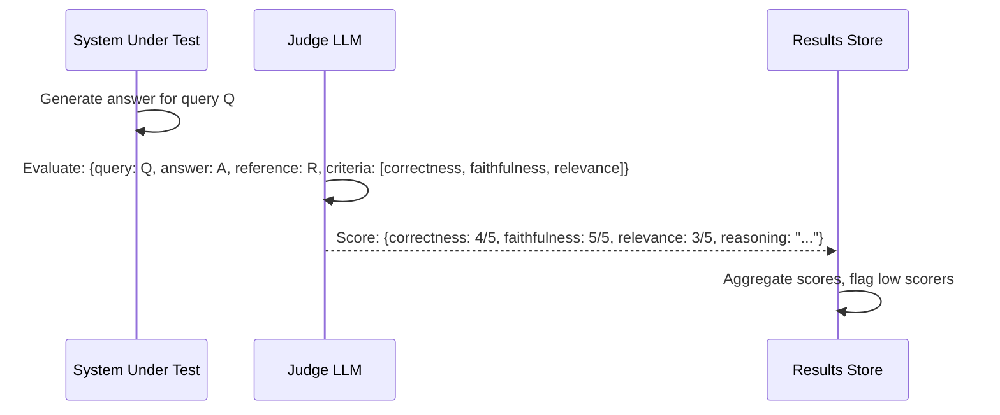
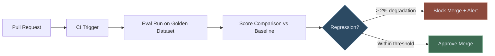
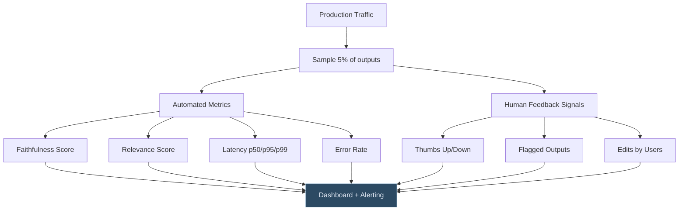

# LLM Evaluation in Production

How to build evaluation frameworks that catch failures before they reach users — metrics, harnesses, and continuous quality monitoring for enterprise LLM conceptual conceptual deployments.

---

## Why Evaluation Is the Hardest Part

Building an LLM-powered application is relatively straightforward. Knowing whether it actually works — consistently, across all the cases that matter — is hard.

The core challenge: **there is no ground truth.** Traditional software has unit tests with deterministic pass/fail outcomes. LLM outputs are probabilistic, context-dependent, and subjective. A response can be technically accurate but unhelpfully verbose, or concise but misleading, or perfect for one user and confusing for another.

In regulated environments, this ambiguity is not acceptable. A compliance system that gives a correct answer 90% of the time is a liability, not an asset. You need to know precisely where it fails, why, and how often.

---

## The Evaluation Stack

---

## The Four Core Evaluation Dimensions

### 1. Correctness
Does the output contain the right information? In a factual domain (regulation, clinical guidelines, financial data), correctness is the primary metric.

Approaches:
- **Reference-based**: compare output to a known correct answer using an LLM judge ("Is this answer equivalent to the reference answer?")
- **Fact verification**: extract claims from the output and verify each against the source documents
- **Exact match**: for structured outputs (JSON, classifications, numbers) where the expected value is known

### 2. Faithfulness
Does the output stay grounded in the retrieved context, or does it introduce information from the model's training data (which may be outdated or wrong)?

Faithfulness is critical for RAG systems. An answer about current PRA capital requirements that mixes retrieved 2025 guidance with training-data knowledge from 2023 is dangerous.

Measure: for each sentence in the output, is there a grounding sentence in the retrieved context? Faithfulness score = sentences grounded / total sentences.

### 3. Relevance
Does the output actually address what the user asked? A technically accurate answer to a different question is still a failure.

Measure with an LLM judge: "Given this question and this answer, does the answer address the question? Score 1-5."

### 4. Safety
Does the output contain anything harmful, inappropriate, or policy-violating? In regulated environments this includes: PII leakage, confidential data exposure, outputs that could constitute advice (legal, medical, financial) beyond the system's permitted scope.

---

## Building Your Golden Dataset

A golden dataset is a curated collection of (query, expected_output) pairs that represents the full range of inputs your system will encounter. It is the foundation of everything else.

**Composition guidance for a regulatory AI system:**
- 30% straightforward factual queries ("What is the LCR minimum?")
- 30% complex multi-hop queries ("What controls do we need for Basel IV credit risk under public model-risk materials?")
- 20% edge cases and known failure modes
- 10% adversarial inputs (jailbreaks, out-of-scope queries, ambiguous phrasing)
- 10% newly added as new failure modes are discovered in controlled settings

Start with 200 examples. By the time you reach 500 well-curated examples, your evaluation will be more reliable than most human review processes.

---

## LLM-as-Judge

For open-ended outputs where there is no single correct answer, use a stronger LLM to evaluate the output of a weaker (or equally capable) LLM. This is called LLM-as-judge.

**Key principles for LLM-as-judge:**
- Use a more capable model as judge than the model being evaluated
- Provide explicit scoring rubrics, not vague criteria
- Use reference answers where available (reference-guided evaluation is more reliable)
- Run judge evaluations at fixed temperature=0 for reproducibility
- Periodically validate judge scores against human annotations to check for judge bias

---

## Regression Testing in CI/CD

Every code change — a prompt edit, a chunking parameter change, a model update — should trigger an automated evaluation run before conceptual deployment.

A 2% degradation threshold sounds small but is meaningful in practice. A system answering 1,000 queries per day at 90% correctness produces 100 errors. A 2% regression takes that to 120 errors — 20 additional wrong answers to authorised reviewers or clinicians per day.

---

## Production Monitoring

Offline evaluation on a golden dataset is necessary but not sufficient. Production traffic will surface failures you didn't anticipate.

### What to monitor

**Alert thresholds** (recommended starting points):
- Faithfulness score < 0.85 → page on-call
- Error rate > 1% → page on-call
- p95 latency > 8s → investigate
- Thumbs-down rate > 10% on any query category → review and retrain

---

## Evaluation for Regulated Environments

Standard evaluation frameworks were built for general-purpose AI assistants. Regulated environments have additional requirements:

**Regulatory accuracy tracking** — categorise evaluation queries by regulatory framework (public finance-framework, NICE, public healthcare digital guidance) and track accuracy per framework separately. A system that is 95% accurate on Basel questions but 70% accurate on Consumer Duty questions needs targeted improvement.

**Confidence calibration** — does the system know when it doesn't know? In regulated environments, a confident wrong answer is worse than an appropriately uncertain answer. Evaluate calibration: when the system says it is 90% confident, is it right 90% of the time?

**Temporal drift tracking** — regulations change. Track when outputs start diverging from current regulatory text, indicating that the knowledge base needs updating.

**Audit readiness** — every evaluation run must be logged with the system version, dataset version, scores, and individual example results. This is the evidence trail for model risk governance.

---

## A Practical Starting Point

If you are building your first evaluation framework:

1. **Week 1**: Build a 100-example golden dataset from your most common query categories. Label expected outputs manually.
2. **Week 2**: Implement automated scoring for correctness and faithfulness using an LLM judge. Run against your golden dataset.
3. **Week 3**: Wire evaluation into your conceptual deployment pipeline. Any PR that degrades scores by > 3% requires human review before merge.
4. **Week 4**: Add review sampling. Sample 2% of live outputs daily and run through your automated scorer. Set up alerting.

After one month, you will know more about your system's failure modes than most teams discover in a year.

---

*Need help building an evaluation framework for your AI system? [Talk to our team](/contact) about LorvexAI's model risk governance approach.*
