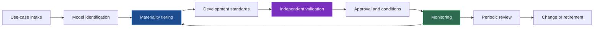

# Model Risk Management for AI - PRA SS1/23 and US Supervisory Guidance

AI has made model risk management more important, not less.

Large language models, machine learning models, retrieval systems, and agentic workflows can all look different from traditional scorecards or valuation models. But the core supervisory question remains familiar: **is the model fit for purpose, controlled, monitored, and subject to effective challenge?**

In the UK, the PRA's [SS1/23 Model Risk Management Principles for Banks](https://www.bankofengland.co.uk/prudential-regulation/publication/2023/may/model-risk-management-principles-for-banks-ss) provides a useful reference point. In the United States, banking agencies have long emphasised model risk management through supervisory guidance, with updated interagency guidance published in 2026.

This article is not a legal interpretation. It is a practical way to think about AI model risk.

---

## First: Decide Whether It Is a Model

One mistake is assuming that if something uses a vendor API or a foundation model, it is not really "our model." Another mistake is treating every prompt as a full model validation exercise.

The useful middle ground is classification.

| AI component | Model risk question | Likely control focus |
| --- | --- | --- |
| Traditional ML model | Does it produce reliable predictions for its intended use? | Development, validation, monitoring |
| LLM prompt workflow | Are instructions stable and outputs controlled? | Prompt governance, testing, human review |
| RAG system | Are retrieved sources accurate, authorised, and traceable? | Retrieval quality, source control, evidence logging |
| Agentic workflow | Can tools be used safely and within scope? | Tool permissions, policy gates, escalation |
| Vendor AI tool | Can the firm understand and oversee material risk? | Vendor due diligence, assurance, monitoring |

The classification does not need to be perfect on day one. But it must be explicit and reviewable.

---

## The AI Model Risk Lifecycle

For AI, the lifecycle should pay special attention to:

- Data provenance and permitted use
- Explainability and limitations
- Hallucination and unsupported output risk
- Bias and fairness where relevant
- Cybersecurity and prompt injection
- Human oversight and decision boundaries
- Vendor dependency and concentration risk
- Change management for models, prompts, embeddings, and retrieval sources

---

## Tiering Makes Governance Proportionate

Not all AI use cases carry the same risk. A useful tiering model considers both impact and complexity.

| Tier | Example use | Governance level |
| --- | --- | --- |
| Low | Internal drafting or knowledge search with no decision impact | Lightweight registration, usage rules, basic monitoring |
| Medium | Workflow support for risk, compliance, operations, or reporting teams | Evidence pack, testing, human review, periodic review |
| High | Material influence on customer outcomes, risk decisions, capital, liquidity, financial reporting, or regulatory submissions | Formal model risk review, independent validation, senior approval, continuous monitoring |

Tiering is not a loophole. It is how firms avoid over-controlling low-risk use cases while under-controlling serious ones.

---

## What Validation Means for AI

For AI systems, validation is broader than an accuracy score.

| Validation dimension | What to test |
| --- | --- |
| Conceptual soundness | Does the design make sense for the intended use? |
| Data quality | Are inputs complete, permitted, representative, and traceable? |
| Performance | Does it work across realistic scenarios and edge cases? |
| Robustness | Does it fail safely under unusual or adversarial inputs? |
| Explainability | Can users understand the basis and limitations of outputs? |
| Governance | Are approvals, overrides, and limitations visible? |
| Monitoring | Can drift, degradation, misuse, or incidents be detected? |

For RAG and LLM systems, validation should include retrieval tests, citation checks, unsupported-answer tests, and human-review sampling.

---

## Effective Challenge Still Matters

AI programmes often move fast because the technology is exciting. Model risk management exists to slow down the wrong things and speed up the right ones.

Effective challenge should ask:

- Is the use case appropriate for AI?
- Is the model or workflow explainable enough for the decision context?
- Are limitations clearly documented?
- Are humans reviewing the right outputs?
- Are overrides tracked?
- Is monitoring meaningful, or just dashboard decoration?
- Can the system be stopped if it behaves badly?

This is not anti-innovation. It is how innovation earns trust.

---

## Final Thought

AI model risk management should not be reduced to a policy attachment saying "LLMs are covered." The operating model needs to show how AI is inventoried, tiered, validated, monitored, challenged, and retired.

The strongest approach is practical and evidence-led: know where AI is used, know what could go wrong, and keep enough evidence to prove the controls are working.

---

*Educational note: This article is for general research and learning. It is not legal, regulatory, compliance, model validation, audit, or professional advice.*
