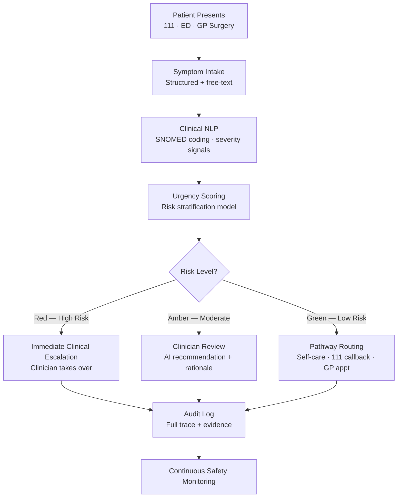
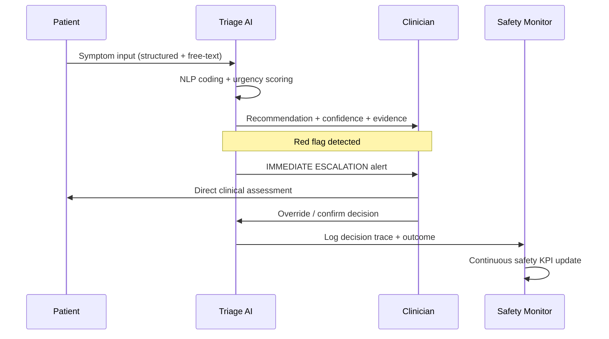
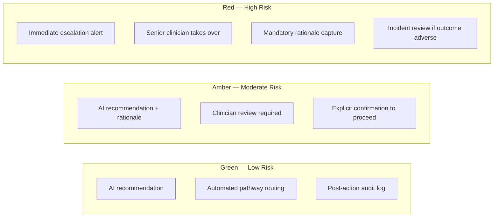

# NHS AI Triage Without Harm

A safety-first architecture for NHS front door triage that improves access while protecting clinical accountability.

---

## Article Focus

- Written for: NHS urgent care leaders, clinical safety teams, and healthcare digital transformation teams
- Primary value: safe AI triage acceleration with mandatory human escalation controls

---

## Why This Matters Now

Front door services across the NHS face sustained pressure:

- High emergency department demand
- Significant 111 and GP triage volume
- Capacity mismatch between demand and clinical staffing

AI can help prioritise and route patients faster, but only if safety is engineered into the system from day one.

---

## Safety-First Design Principles

- AI should assist, not replace, clinical judgment
- High-risk uncertainty must trigger human escalation
- Every recommendation must be explainable and auditable
- Safety performance should be monitored continuously
- Model updates should require governance sign-off

---

## Reference Architecture for NHS Triage

---

## Triage Decision Flow

---

## Red-Flag Escalation Logic

---

## Clinical Safety Sequence

---

## KPI Framework for Safe Rollout

### Patient Safety
- Rate of missed urgent cases
- Escalation timeliness
- Safety incident rate per 1,000 triaged cases

### Operational Performance
- Time to disposition
- Queue reduction at high-demand hours
- Clinician time saved on low-risk pathways

### Trust and Governance
- Explainability coverage (% of decisions with trace)
- Human override rate by cohort
- Bias and fairness monitoring across demographics

---

## Governance Requirements by Tier

---

## Implementation Roadmap for NHS Teams

1. Start with one bounded triage pathway (for example minor illness)
2. Define explicit red-flag and escalation rules with clinical leads
3. Run AI in shadow mode against current triage practice
4. Validate safety metrics before any live recommendation use
5. Expand incrementally with governance checkpoints and regular audit

---

## Final Thought

The best NHS triage AI is not the most autonomous system. It is the safest system: fast when confidence is high, and immediately human-led when risk is uncertain.
