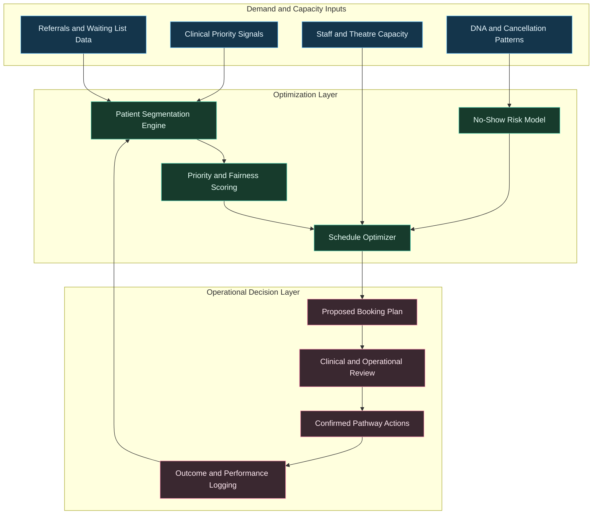

---
title: From Waiting Lists to Smart Pathways
date: 2026-03-31
excerpt: A practical AI blueprint for NHS elective recovery that improves throughput, fairness, and patient outcomes.
tags:
  - NHS
  - Elective Recovery
  - Healthcare Operations
  - AI Strategy
---

# From Waiting Lists to Smart Pathways

A practical AI blueprint for NHS elective recovery that improves throughput, fairness, and patient outcomes.

---

## The Elective Recovery Challenge

NHS elective services are balancing:

- Long referral-to-treatment pathways
- High variation in demand and staffing
- Theatre and clinic under-utilization in some windows
- High downstream impact from cancellations and no-shows

AI can support pathway orchestration, but it must preserve fairness, transparency, and clinical governance.

---

## Where AI Delivers Immediate Value

- Referral prioritization with risk-aware segmentation
- Dynamic scheduling for clinics and theatres
- No-show risk prediction and proactive outreach
- Capacity forecasting by specialty and site
- Bottleneck detection across end-to-end pathways

---

## Elective Pathway Intelligence Architecture

---

## Referral-to-Treatment Flow with Feedback

---

## Fairness and Governance Guardrails

- Prioritization must include clinical urgency and vulnerability factors
- Protected groups should be monitored for adverse scheduling drift
- Every booking decision should preserve auditability and rationale
- High-impact exceptions should require human review and sign-off

---

## KPI Dashboard for Elective Recovery

### Access and Throughput
- Median and 95th percentile waiting time by specialty
- Treated patients per theatre session
- Utilization rate by site, list, and consultant team

### Reliability
- Cancellation and DNA rates
- Rebooking cycle time
- Pathway completion rate

### Equity and Quality
- Waiting-time variance across patient cohorts
- Clinical outcome signals post-treatment
- Override and exception rates with documented rationale

---

## Implementation Plan

1. Prioritize one specialty with high waiting-list pressure
2. Build data quality baseline for referrals, scheduling, and outcomes
3. Deploy advisory-only optimization with clinician oversight
4. Track fairness and throughput KPIs weekly
5. Expand gradually across specialties after stable performance

---

## Final Thought

Elective recovery improves fastest when AI is used as a pathway intelligence layer, not just a scheduling tool. The objective is sustained throughput with equitable, clinically grounded decisions.
