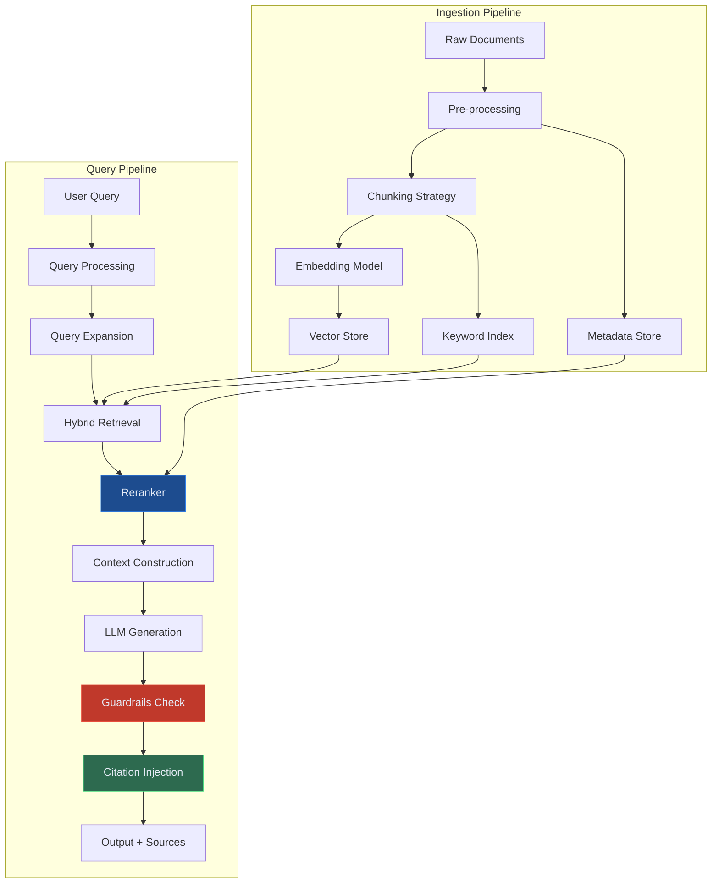
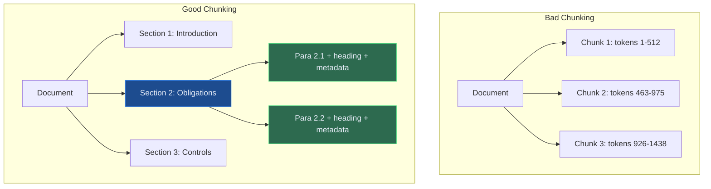
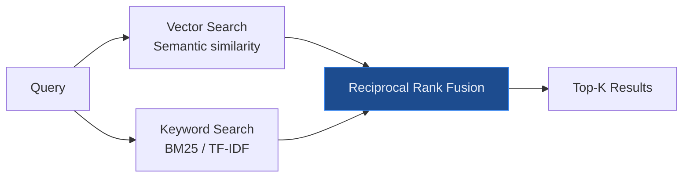
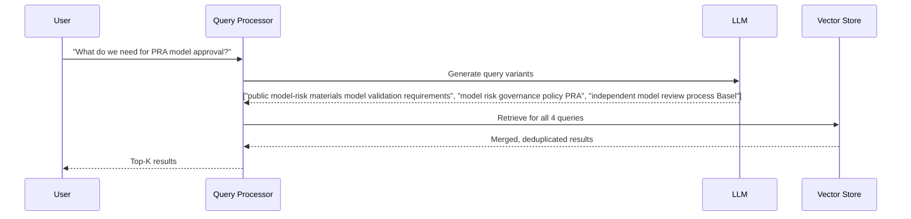
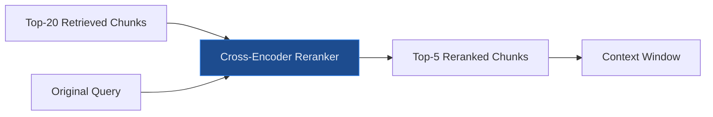
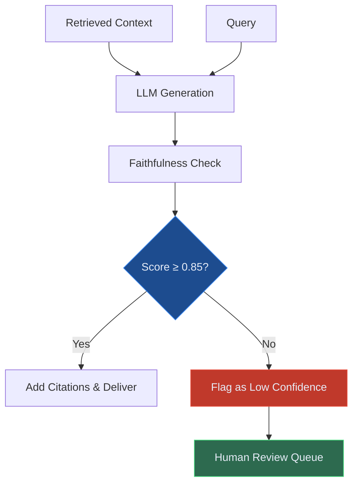

# Production RAG — Beyond the Basics

Building retrieval-augmented generation systems that actually work in controlled settings — chunking strategy, reranking, governance, and hallucination control for enterprise conceptual conceptual deployments.

---

## The Gap Between Demo RAG and Production RAG

Every RAG demo looks the same: ingest a PDF, ask a question, get an answer. It works beautifully in a notebook. Then you deploy it to production with 50,000 documents, real users with ambiguous queries, and a legal requirement that every answer is accurate and traceable — and it falls apart.

Production RAG is a fundamentally different engineering problem from demo RAG. The failure modes are subtle: retrieved chunks that are technically relevant but contextually wrong, answers that are fluent but hallucinated, queries that retrieve nothing useful because the user phrased things differently from the document author.

This article covers the decisions that actually matter for enterprise RAG — the ones that separate a system that works at scale from one that works in a demo.

---

## The Full Production RAG Architecture

Each component in this architecture has decisions that significantly impact controlled-system quality. Let's work through the most critical ones.

---

## Chunking Strategy

Chunking is where most controlled RAG systems fail. The default — split every 512 tokens with 50-token overlap — works for demos and fails for enterprise documents.

### The core problem

Regulatory documents, clinical guidelines, and policy manuals are **hierarchically structured**. A chunk that contains sentences 200–211 of a PRA supervisory statement has no meaning without the section heading, the chapter context, and the preceding obligation. Naive chunking destroys this structure.

### Recommended chunking approaches by document type

| Document Type | Recommended Strategy |
|---|---|
| Regulatory PDFs (public finance-framework) | Semantic sectioning by heading hierarchy + parent context prepending |
| Clinical guidelines (NICE, NHS) | Paragraph-level with section + subsection metadata |
| Contracts and agreements | Clause-level chunking with clause number + parent section |
| Structured data (tables, reports) | Row-level with table header + column context |
| Unstructured prose | Sliding window with semantic boundary detection |

**Parent-child chunking** is the most effective pattern for regulatory documents: store both a large parent chunk (full section) and small child chunks (individual paragraphs). Retrieve on child chunks for precision; return the parent chunk as context for the LLM. This preserves semantic context without overwhelming the context window.

---

## Hybrid Retrieval

Pure vector search misses exact-match queries. Pure keyword search misses semantic similarity. Production systems need both.

**Reciprocal Rank Fusion (RRF)** merges the two ranked lists without needing calibrated scores. A document ranked 3rd in vector search and 7th in keyword search gets a combined score that typically outperforms either list alone.

For financial regulation queries, hybrid retrieval reduces "no result" failures by 40–60% compared to vector-only approaches, because regulatory language is precise and literal — "LCR" should match exactly, not semantically.

---

## Query Processing

Users rarely phrase queries the way documents are written. Query processing closes this gap.

### Query expansion

Generate 3–5 alternative phrasings of the query before retrieval. A user asking "what do we need for PRA model approval?" might not use the words "model risk governance policy" that appear in the regulation.

### HyDE (Hypothetical Document Embeddings)

Generate a hypothetical ideal answer to the query, then use that answer's embedding for retrieval instead of the query embedding. Particularly effective for technical queries where the question phrasing differs significantly from the answer phrasing.

---

## Reranking

The first retrieval pass optimises for recall — it finds everything possibly relevant. Reranking optimises for precision — it puts the most relevant results first.

A cross-encoder reranker reads the full query and each candidate chunk together, producing a relevance score that is significantly more accurate than vector similarity alone. The cost: it's slower and more expensive. For enterprise use cases with compliance implications, the quality improvement is worth it.

A reference design may use a domain-fine-tuned reranker on our regulatory corpus — the off-the-shelf models are not trained on public finance-framework language patterns and make systematic errors on regulatory text.

---

## Hallucination Control

The hardest problem in controlled settings RAG. An LLM will produce fluent, confident text even when the retrieved context does not contain the answer.

### The three-layer approach

**Layer 1: Retrieval quality** — if nothing relevant is retrieved, the LLM should say "I don't have information on this" rather than fabricating. Implement a minimum relevance threshold; below it, return a "no results" response rather than an LLM answer.

**Layer 2: Constrained generation** — instruct the LLM explicitly: "Answer only from the provided context. If the context does not contain the answer, say 'This information is not in my knowledge base.' Do not use prior knowledge."

**Layer 3: Faithfulness checking** — after generation, run a faithfulness check: does every claim in the output have a grounding sentence in the retrieved context? This can be automated with a lightweight verifier LLM.

---

## Citation and Source Tracking

In regulated environments, every answer must cite its source. Users — authorised reviewers, clinicians, risk managers — need to verify the output against the source document.

The citation system must track:
- **Source document** — name, version, date
- **Section/page reference** — exact location in the source
- **Chunk content** — the specific text used
- **Retrieval score** — how confident the system was in this source
- **Generation timestamp** — when this answer was produced

This citation chain is the audit trail. In a governance review, the regulator can ask "what was the basis for this control mapping?" and the system must produce a complete provenance record.

---

## RAG Evaluation Framework

You cannot improve what you cannot measure. Production RAG requires continuous evaluation across four dimensions:

| Metric | Measures | Target |
|---|---|---|
| **Retrieval Recall@K** | Are all relevant chunks in the top-K? | ≥ 85% |
| **Context Precision** | Are retrieved chunks actually relevant? | ≥ 80% |
| **Answer Faithfulness** | Does the answer only use retrieved context? | ≥ 90% |
| **Answer Relevance** | Does the answer address the question? | ≥ 85% |

Run these evaluations weekly on a curated golden dataset of query/expected-answer pairs specific to your domain. When scores degrade, it signals a data quality issue (new documents not ingested correctly), a retrieval issue (embedding model drift), or a generation issue (prompt regression).

---

## Enterprise RAG in Practice: LorvexAI's Approach

The Regulatory Intelligence Platform reference blueprint is based on a controlled RAG stack with:

- **Hierarchical chunking** of 100+ regulatory sources with parent-context injection
- **Domain-specific embedding model** fine-tuned on financial regulation language
- **Hybrid retrieval** (vector + BM25) with RRF merging
- **Fine-tuned cross-encoder reranker** on public finance-framework/Basel document pairs
- **Faithfulness scoring** on every generated answer
- **Full citation chain** with section-level references for every claim
- **Weekly evaluation** against a 500-query golden dataset

The result: 94% answer faithfulness in controlled settings, 89% retrieval recall@5, and a complete audit trail for every output.

---

*Want to see this RAG stack in action? [Book a demo](/contact) of the Regulatory Intelligence Platform or [explore our products](/products).*
