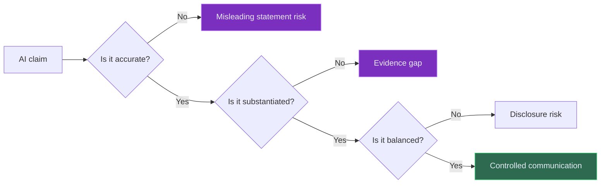
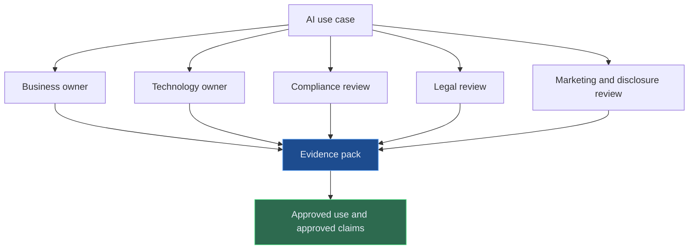

# SEC and AI - AI-Washing, Predictive Analytics, Conflicts, and Disclosure Risk

The SEC's AI message has a different flavour from banking supervision. It is less about prudential model governance and more about investor protection, disclosures, conflicts, marketing claims, and market integrity.

For firms using AI in investment management, broker-dealer activity, investor interaction, trading, marketing, compliance, or disclosures, the practical message is straightforward: **do not let the AI story outrun the evidence.**

---

## AI-Washing Is a Governance Failure

The SEC has brought enforcement attention to firms making misleading statements about AI use. That matters because AI claims can influence investor trust, client expectations, valuation narratives, and product perception.

AI-washing is not only a marketing issue. It is a governance issue.

A strong control is simple: every material external AI claim should be traceable to evidence.

| Claim type | Evidence to keep |
| --- | --- |
| "We use AI in our investment process" | Description of use, limitations, governance approval |
| "AI improves performance" | Methodology, testing, performance attribution, limitations |
| "AI reduces risk" | Risk metrics, testing evidence, assumptions |
| "AI personalises advice or interaction" | Conflict review, supervision, disclosure controls |

If the evidence does not exist, the claim should probably not exist either.

---

## Predictive Analytics and Conflicts

The SEC has focused attention on predictive data analytics and similar technologies in investor interactions. The concern is not that analytics are inherently bad. The concern is that technology can optimise for firm revenue, engagement, trading frequency, or behavioural nudges in ways that conflict with investor interests.

The governance question is:

**What is the system optimising for, and could that optimisation place the firm's interest ahead of the investor's interest?**

| Risk | Example control question |
| --- | --- |
| Hidden objective function | Is the model optimising for client outcome, firm revenue, engagement, or another metric? |
| Behavioural nudging | Could prompts, rankings, or recommendations steer harmful activity? |
| Personalisation | Are investor characteristics used appropriately and transparently? |
| Testing gaps | Has the firm tested outcomes across client segments? |
| Disclosure gaps | Are material uses and limitations described accurately? |

---

## AI Governance for SEC-Regulated Contexts

For SEC-facing firms, AI governance should include a communication control layer.

This matters because an AI system can be technically controlled but externally misrepresented. That still creates risk.

---

## What Good Looks Like

| Area | Practical expectation |
| --- | --- |
| Inventory | Know where AI is used in investor-facing, trading, advisory, marketing, and compliance processes |
| Claims control | Substantiate public and client-facing AI statements |
| Conflict review | Identify whether AI optimisation creates investor conflicts |
| Testing | Test outputs, recommendations, segmentation, and failure modes |
| Supervision | Keep human review where judgement or client impact matters |
| Recordkeeping | Preserve evidence, approvals, prompts, versions, and decision logs where relevant |

---

## Final Thought

The SEC angle on AI is a reminder that governance is not only about models. It is also about words, incentives, communications, and investor impact.

For financial firms, the safest AI claim is the one that is accurate, evidenced, balanced, and approved.

If AI is genuinely useful, the evidence should be strong enough to speak plainly.

---

*Educational note: This article is for general research and learning. It is not securities law, regulatory, compliance, investment, financial, audit, or professional advice.*
