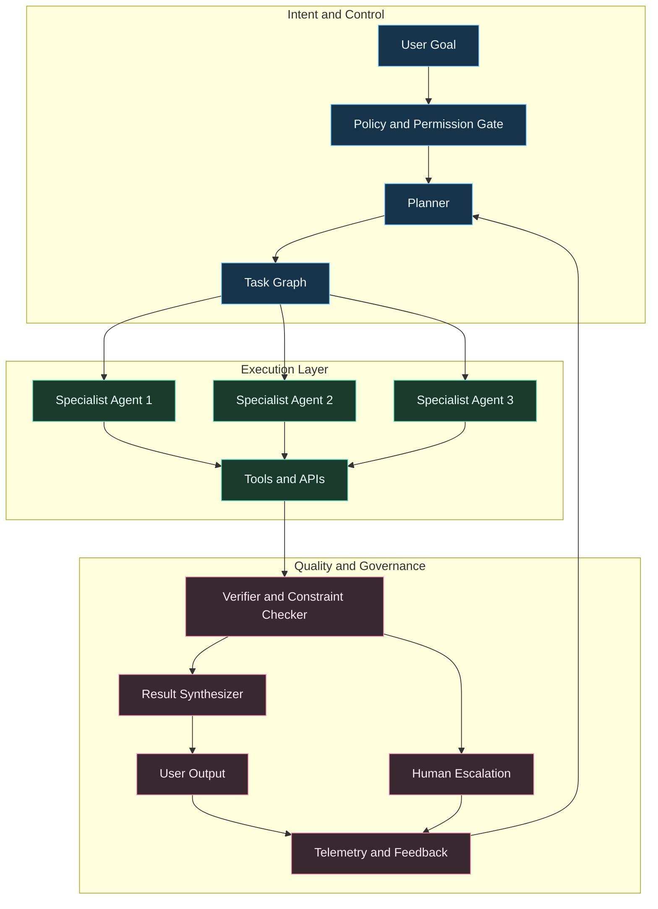
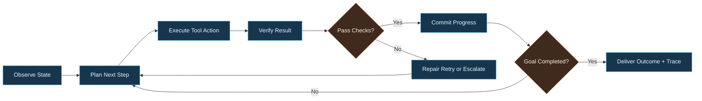

---
title: The Rise of Agentic AI
date: 2026-02-10
excerpt: Agentic AI is moving beyond simple automation into autonomous systems that execute multi-step business workflows.
tags:
  - Agentic AI
  - Automation
  - Systems Design
---

# The Rise of Agentic AI

Agentic AI shifts the focus from single-turn generation to autonomous systems that can plan, act, verify, and adapt across multi-step workflows.

---

## From Copilots to Autonomous Operators

Traditional assistants generate answers. Agentic systems generate outcomes.

A mature agentic stack combines:

- Goal decomposition and planning
- Tool use and API execution
- Persistent task memory
- Self-check and retry strategies
- Human escalation when confidence is low

---

## Agentic System Blueprint

---

## Core Capabilities You Need

### 1. Planning and Decomposition
- Break goals into executable subtasks
- Select strategy based on time, risk, and dependencies
- Manage branching and rollback

### 2. Reliable Tool Execution
- Typed interfaces for every tool
- Retry, timeout, and fallback policies
- Secure secrets and scoped permissions

### 3. Memory and Context Management
- Session memory for short-running tasks
- Episodic memory for recurring workflows
- Retrieval memory from enterprise knowledge bases

### 4. Verification and Guardrails
- Validate outputs before final response
- Enforce policy and compliance constraints
- Prefer abstain/escalate over unsafe confidence

---

## Operating Loop (How Agents Stay Reliable)

---

## High-Value First Use Cases

- Sales operations: RFP drafting with policy-safe citations
- Support operations: multi-system case triage and resolution suggestions
- Internal IT: incident investigation playbooks with automated evidence gathering
- Finance ops: close-cycle anomaly triage with human approval checkpoints

---

## Metrics That Matter

### Effectiveness
- Task completion rate
- First-pass success rate
- Human override frequency

### Reliability
- Failed action rate
- Verification failure rate
- Escalation latency

### Economics
- Cost per completed workflow
- Time saved per process
- Throughput uplift versus manual baseline

---

## Common Failure Patterns

### Failure: Tool Hallucination
- Symptom: Agent references nonexistent API actions
- Fix: strict tool schema + compile-time validation

### Failure: Infinite Retry Loops
- Symptom: Agent retries without changing strategy
- Fix: retry budget + forced replan threshold

### Failure: Unsafe Autonomy
- Symptom: high-impact actions taken without review
- Fix: risk-tiered approvals and action allowlists

---

## Implementation Roadmap

1. Pick one bounded workflow with measurable business impact
2. Define policy boundaries and approval thresholds
3. Build planner + tool layer with verification hooks
4. Add observability traces for every step and decision
5. Launch in shadow mode, then controlled rollout
6. Expand only after reliability KPIs are stable

---

## Final Thought

The winning pattern is not maximum autonomy. It is calibrated autonomy: agents that are fast when confidence is high, and accountable when risk is high.
