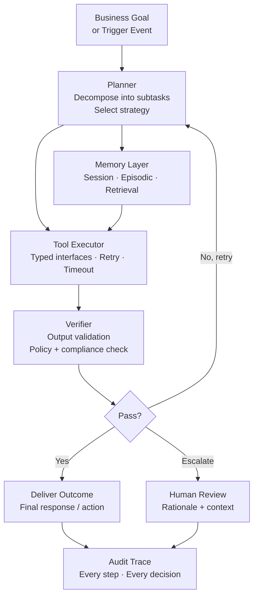
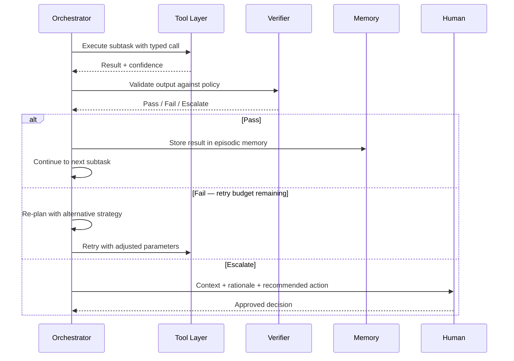
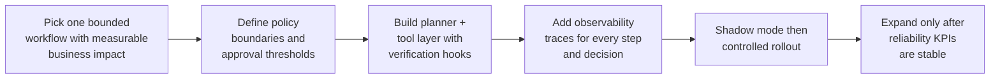

# The Rise of Agentic AI

Agentic AI shifts the focus from single-turn generation to autonomous systems that can plan, act, verify, and adapt across multi-step workflows.

---

## Article Focus

- Written for: technology platform leaders and finance operations teams adopting workflow automation
- Primary value: controlled autonomy with measurable reliability and governance

---

## From Copilots to Autonomous Operators

Traditional assistants generate answers. Agentic systems generate outcomes.

A mature agentic stack combines:

- Goal decomposition and planning
- Tool use and API execution
- Persistent task memory
- Self-check and retry strategies
- Human escalation when confidence is low

---

## Agentic System Blueprint

---

## Core System Architecture

---

## Core Capabilities You Need

### 1. Planning and Decomposition
- Break goals into executable subtasks
- Select strategy based on time, risk, and dependencies
- Manage branching and rollback

### 2. Reliable Tool Execution
- Typed interfaces for every tool
- Retry, timeout, and fallback policies
- Secure secrets and scoped permissions

### 3. Memory and Context Management
- Session memory for short-running tasks
- Episodic memory for recurring workflows
- Retrieval memory from enterprise knowledge bases

### 4. Verification and Guardrails
- Validate outputs before final response
- Enforce policy and compliance constraints
- Prefer abstain/escalate over unsafe confidence

---

## Operating Loop (How Agents Stay Reliable)

---

## Reliability Loop — Detail

---

## High-Value First Use Cases

| Domain | Use Case | Agent Benefit |
| --- | --- | --- |
| Finance Ops | Close-cycle anomaly triage | Assembles evidence + routes to approver automatically |
| Financial Crime | Suspicious payment investigation | Investigation + evidence pack in minutes vs hours |
| Internal IT | Incident investigation playbooks | Multi-system evidence gathering + runbook execution |
| Sales Ops | RFP drafting with citations | Policy-safe, traceable proposal content |
| Support Ops | Multi-system case resolution | Cross-system lookup + recommended resolution |

---

## Metrics That Matter

### Effectiveness
- Task completion rate
- First-pass success rate
- Human override frequency

### Reliability
- Failed action rate
- Verification failure rate
- Escalation latency

### Economics
- Cost per completed workflow
- Time saved per process
- Throughput uplift versus manual baseline

---

## Common Failure Patterns

| Failure | Symptom | Fix |
| --- | --- | --- |
| Tool hallucination | Agent references nonexistent API actions | Strict tool schema + compile-time validation |
| Infinite retry loops | Agent retries without changing strategy | Retry budget + forced replan threshold |
| Unsafe autonomy | High-impact actions taken without review | Risk-tiered approvals and action allowlists |
| Memory contamination | Prior session context bleeds into new task | Scoped memory with session isolation |

---

## Implementation Roadmap

---

## Final Thought

The winning pattern is not maximum autonomy. It is calibrated autonomy: agents that are fast when confidence is high, and accountable when risk is high.
